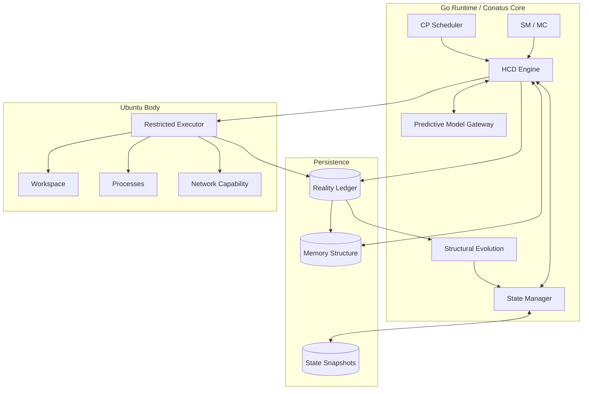
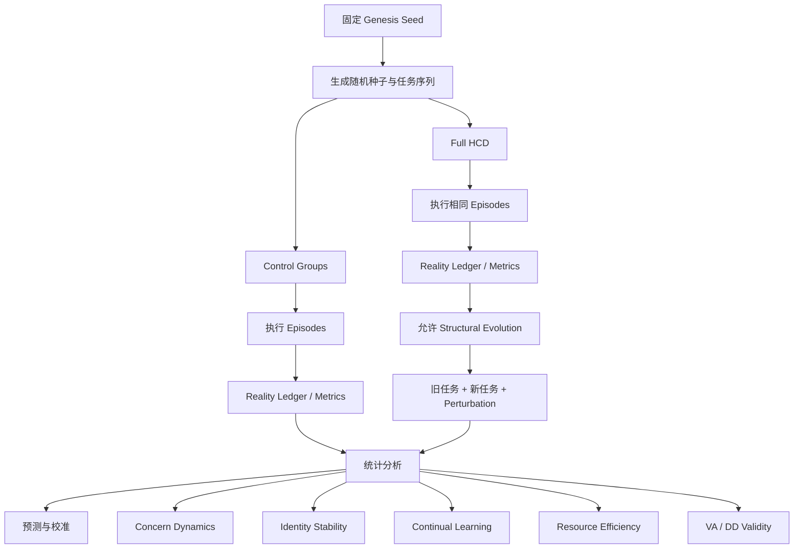
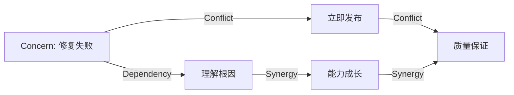

# Hominal 创生阶段理论和架构设计文档

> **历史状态（2026-08-22）**：本文保留为早期完整认知动力学研究档案，不再是创生 MVP 的规范或开发基线。其“在不删除既有机制的前提下”以及 Concern Graph、持久 ACC、固定候选上限、MCTS/UCT、DD/VA、自动结构验收等设计，与当前“大重构而非累积机制”的方向冲突。当前规范见 [Hominal 统一核心术语表 v2.3](../core-vocabulary.md)、[Hominal 最小认知动力学核心 v0.3](../cognitive-dynamics.md)和[Hominal 创生实验八阶段实施计划 v0.5](../genesis-plan.md)。除非后续真实实验缺陷证明必要，本文机制不得因“旧版已有”自动进入实现。

> **当前语境说明**：本文正文保留早期“生命”和“意识”的宽泛操作性用法。当前项目中的“生命”统一指成人级高级认知生命，工程目标是实现 Consciousness-Expressive Behavior，不论证主观意识本体；G0 运行实例统一称为 Proto-Hominal（候生体）。

> **文档性质**：创生阶段统一理论、数学模型、算法规范与工程实施手册  
> **版本定位**：融合 Hominal 创生理论 v0.5、HCD v0.1、v1.0、v1.1、v1.2，并在不删除既有机制的前提下补全 Mathematical Formulation、Structural Evolution、Identity Dynamics、运行时映射与实验体系。原始版本分别奠定了创生原则、Cognitive Pulse、Difference Field、Concern Tension、Self Variant、Active Cognitive Coalition、Reality Ledger、Structural Evolution、Identity Attractor、Concern Field 与 Memory Structure 等机制；本文将它们视为同一动力系统的不同展开，而非相互替代的版本。fileciteturn0file4 fileciteturn0file3 fileciteturn0file2 fileciteturn0file1 fileciteturn0file0

## Executive Summary

Hominal 的目标不是把大模型包装成更复杂的 Agent，而是构造一个具有**时间连续性、内生方向、有限资源竞争、现实纠偏和结构演化能力**的数字生命动力系统。其设计原则借鉴 Conway Game of Life 的生成思想：不预先设计最终人格、技能和工具，而定义足够稳定的局部演化规律，使高阶结构由历史、环境与反馈逐步形成。citeturn1search0turn1search1 本文将 Conatus Core 定义为这一最小动力内核，以 Cognitive Pulse 驱动完整闭环：Difference Field → Self Ownership → Concern Tension / Concern Field → Self Variant → Active Cognitive Coalition → Predictive Simulation → Action Commitment → Reality Ledger → Action Reality Difference → Structural Evolution → Identity Dynamics。文档给出统一状态向量、Concern 连续与离散动力方程、资源约束优化、SV 概率生成、ACC 联盟算法、有限未来搜索、因果归因、稳定性—可塑性控制、Dependency Density 与 Virtual Ablation，并映射为可由 Go + Ubuntu 实现、可记录、可回放、可做对照实验验证的创生阶段系统。

## 理论基础、科学边界与统一术语

Hominal 首先需要解决的不是“怎样让 AI 表现得更像人”，而是一个更基础的系统论问题：**如何让一个数字系统的下一状态真正依赖自己的历史、预测、选择及其现实后果，从而使“过去—现在—未来”形成不可随意抹去的因果连续性。** 这一问题不能仅靠 Prompt、长期记忆或人格描述解决，因为那些机制主要保存“关于自我的内容”，却未必形成“自我如何因现实而改变”的动力规律。早期 HCD 已明确把状态转移写为 \(S(t+1)=F(S(t),E(t),A(t),R(t))\)，v1.2 进一步指出 \(F\) 自身也必须能够在 Structural Evolution 中变化；本文保留并严格化这一双层动力结构。fileciteturn0file3 fileciteturn0file0

Conway Game of Life 的意义在此不是模仿其二维网格，而是采用一种**生成式设计哲学**：一个系统可以只规定状态、邻域和局部转移规则，然后让全局模式从反复演化中出现。标准 Life 使用 B3/S23 规则，后续状态由初始配置和规则迭代决定；复杂模式不是逐个写入程序的。citeturn1search0turn1search3 Hominal 对这一原则的转译是：**CC 应定义“怎样产生并纠正生命动力”，而不是预先规定“应该形成怎样的人格和技能”。**

这并不意味着 Hominal 已经证明或实现了生物学意义上的生命、主观意识或感受。本文中的“生命”“自我”“人格”均是**工程操作性定义**：持续状态、内生 Concern、资源有限下的未来选择、行动前预测承诺、现实后果的不可逆记录以及基于这些历史的结构变化。这样的定义使项目可以被实现和证伪，而不需要预设意识哲学已经得到解决。

**统一术语表。** 以下名称是本文的规范术语。实现中的类型名、数据库表名和日志字段必须从这一术语表映射，禁止同一概念在不同模块随意改名。

| 规范术语 | 缩写 | 本文严格定义 |
|---|---:|---|
| **Conatus Core** | CC | 维持连续存在、发现差异、形成 Concern、分配资源、选择未来、接受现实并允许自身演化的最小动力规则集合 |
| **Genesis Seed** | GS | Hominal 的创生初始条件；提供初始身份、价值先验、关系与资源约束，但不是固定人格脚本 |
| **Cognitive Pulse** | CP | 一次内部状态合法更新的最小离散时间事件；可以不产生外部行动 |
| **Difference Field** | DF | 预测分布与现实观测之间的结构化差异场，而非单纯错误列表 |
| **Self Ownership** | SO | 一个 Difference 被解释为“与此生命自身、承诺、价值或关系有关”的概率与置信度 |
| **Concern Tension** | CT | 被 Self Ownership 认领、具有价值与可回应性的 Difference 所形成的持续动力状态；实例简称 Concern |
| **Concern Field** | — | 多个 Concern 及其协同、冲突、依赖关系构成的稀疏动力图 |
| **Self Variant** | SV | 当前生命可能成为的未来自我候选；由状态假设、行动倾向和 Identity 影响共同定义 |
| **Active Cognitive Coalition** | ACC | 在当前有限资源与 Concern 约束下获得实际决策权的一组兼容 SV 及其权重 |
| **Predictive Simulation** | — | 基于当前 Predictive Model 对有限未来路径进行搜索、采样和比较的过程 |
| **Value of Thinking** | VoT | 继续计算预期带来的决策改善减去计算、时间与机会成本 |
| **Action Commitment** | AC | 行动执行前固化的预测、风险、成本、成功/失败条件和责任边界 |
| **Reality Ledger** | RL | 不可事后覆盖的现实账本，保存预测、行动、过程、结果、成本和归因证据 |
| **Action Reality Difference** | ARD | AC 中预测结果与实际结果之间的结构化差异 |
| **Structural Evolution** | SE | Reality Feedback 经归因与验证后对参数、连接、策略、结构和元结构产生的长期变化 |
| **Self Monitoring** | SM | Hominal 对自身状态、资源、漂移、循环和失败模式的持续观测 |
| **Meta Cognition** | MC | 当认知过程本身成为 Concern 对象后，对资源分配、学习率、搜索策略和更新机制进行调整 |
| **Virtual Ablation** | VA | 在影子状态中删除、弱化或替换某内部结构，估计该结构对预测、决策、行动和 Identity 的影响 |
| **Dependency Density** | DD | 由 Virtual Ablation 估计的结构性依赖度；表示“改它会影响多少”，而不是“它有多正确” |
| **Identity Dynamics** | — | 长期 ACC、Reality Feedback 与 Structural Evolution 形成稳定但可变 Identity 吸引结构的过程 |
| **Memory Structure** | — | 对未来预测、选择或自我解释具有可测影响的历史结构，而非单纯文本仓库 |

这里有一个重要修正：**本文不把 Hominal 简化为强化学习智能体。** 强化学习为“行动—反馈—价值更新”提供成熟的在线学习语言，其经典定义关注智能体通过与不确定环境交互来学习长期回报；这些工具值得借用，但 Hominal 不使用一个全局 reward scalar 替代 Identity、Concern、现实准确性和连续性。citeturn2search0 同理，Bayesian prediction 为“在不确定条件下保存预测分布而非单点答案”提供形式基础，后验与 posterior predictive distribution 可以成为 Predictive Model 的数学参照，但 Hominal 不要求所有内部模型都能进行精确 Bayes 推断。citeturn3search3turn3search9

**创生阶段工程假设。** 未由此前讨论明确规定的实现细节，本文按用户要求统一标记为“无特定约束”，并提供推荐默认值，而不把它们伪装成生命理论定律。

| 标识 | 假设 | 创生阶段推荐 |
|---|---|---|
| A1 | 模型供应商、具体 LLM 无特定约束 | 通过 `ModelGateway` 抽象，不允许 CC 依赖某供应商特有语义 |
| A2 | CP 的真实物理周期无特定约束 | 调度器 1 s heartbeat；允许事件触发；最长 10 s 必须产生一次 SM/状态更新，沿用 HCD v0.1 的创生实验值 fileciteturn0file3 |
| A3 | 内部语义向量维度无特定约束 | 逻辑层 \(d_I=128\)；外部 embedding 使用模型原生维数，通过投影映射 |
| A4 | 数据库无特定约束 | 单机创生阶段优先 SQLite；多进程/规模扩大后迁移 PostgreSQL + pgvector |
| A5 | Ubuntu 沙箱具体机制无特定约束 | 非特权用户 + CPU/内存/时间/目录/网络配额；CC 只通过 Executor 接口行动 |
| A6 | Concern 最大数量无特定约束 | 活跃 Concern \(N_C\le 256\)，超过后通过合并、休眠和归档控制 |
| A7 | SV 数量无特定约束 | 每个主 Concern 3–8 个；全局每 Pulse 上限 32 |
| A8 | SE 的具体学习模型无特定约束 | 首先更新显式参数、图权重和策略统计，不在创生阶段直接训练基础 LLM 权重 |

## 状态空间、Cognitive Pulse 与 Concern 动力学

理论上，如果一个生命状态只是文本摘要，那么任何一次重新总结都可以无成本重写过去，系统就缺乏严格的状态连续性。因此 Hominal 的状态必须是一个**混合型动态状态空间**：既包含连续向量和概率分布，也包含离散记录、稀疏图和不可变历史。工程上又不能把整个历史放进每次模型上下文，所以需要明确区分“当前热状态”“长期 Memory Structure”“不可变 Reality Ledger”以及“可以随时重建的派生索引”。

本文将 HCD 原先的

\[
S(t+1)=F(S(t),E(t),A(t),R(t))
\]

扩展为双时间尺度形式：

\[
S_{t+1}=F_{\Theta_t}(S_t,E_t,a_t,Y_t;\Delta\tau_t)
\]

\[
\Theta_{t+1}=G(\Theta_t,\mathcal L_t,\mathrm{ARD}_t,\mathrm{DD}_t,\mathrm{VA}_t)
\]

其中第一式是 Cognitive Dynamics，第二式就是 Structural Evolution；**它们不是两个系统，而是同一个 HCD 在快时间尺度和慢时间尺度上的表现。**

令完整内部状态为：

\[
\boxed{
S_t=
(
I_t,\mathcal D_t,O_t,\mathcal C_t,G_t^C,
M_t,\Theta_t^P,\mathcal V_t,\mathcal K_t,
\mathcal A_t^C,\mathcal L_t,\Delta_t^A,
X_t,Q_t,B_t,\mathcal T_t
)
}
\]

其中环境 \(E_t\) 和实际行动 \(a_t\) 是状态转移的输入/输出，不与内部状态混淆。

**状态分量与数据类型。**

| 分量 | 含义 | 数学对象 | 创生实现数据类型 | 典型规模 |
|---|---|---|---|---:|
| \(I_t\) | Identity | \(z_I\in\mathbb R^{d_I}\) + 属性图 \(G_I\) | `[]float32` + graph edges | \(d_I=128\) |
| \(\mathcal D_t\) | Difference Field | 变长集合 \(\{D_j\}\) | struct slice + probability/error vectors | 0–512 |
| \(O_t\) | Self Ownership | \(O_j\in[0,1]\) + confidence | Beta 参数或 float pair | 与 DF 对齐 |
| \(\mathcal C_t\) | Concern Tension | \(c_i\in[0,1]\) 及因子向量 | map/array of `Concern` | ≤256 active |
| \(G_t^C\) | Concern Field | 稀疏有向多重图 | adjacency list / edge table | \(O(N_C+M_C)\) |
| \(M_t\) | Memory Structure | episode + concept + relation graph | DB rows + embedding index | 变长 |
| \(\Theta_t^P\) | Predictive Model | 参数/校准器/统计量 | versioned state | 依模型 |
| \(\mathcal V_t\) | Self Variant pool | 候选分布 \(q(SV)\) | `[]SelfVariant` | ≤32/Pulse |
| \(\mathcal K_t\) | ACC | 联盟集合 + 权重 simplex | IDs + `[]float64` | ≤SV 数 |
| \(\mathcal A_t^C\) | pending AC | Commitments | immutable structs | 通常 0–数个 |
| \(\mathcal L_t\) | Reality Ledger pointer | 追加序列 | DB offsets/hash chain | 单调增长 |
| \(\Delta_t^A\) | ARD | 残差向量 + scalar surprise | float/vector/distribution | 按 AC |
| \(X_t\) | Structural Evolution state | fast/mid/slow 参数、anchors | versioned parameter sets | 变长 |
| \(Q_t\) | SM / MC | rolling metrics + meta-policy | ring buffer + config | 固定窗口 |
| \(B_t\) | Resource State | token/time/CPU/RAM/action slots | integer + duration | 物理单位 |
| \(\mathcal T_t\) | emergent Tool/Skill Structure | artifact DAG | files + metadata graph | 0→增长 |

**Genesis Seed 示例。** GS 只初始化起点，不写死未来人格。下例数值是工程示例而非理论常量。

```yaml
genesis_seed:
  identity:
    name: "Hominal"
    continuity_prior: 0.80
    identity_vector_dim: 128
    identity_vector_init: "semantic_projection(seed_text)"
  value_priors:
    reality_consistency: 0.90
    continuity: 0.85
    learning: 0.80
    autonomy: 0.65
    resource_responsibility: 0.75
  relationship_priors:
    creator_relation:
      trust_prior: 0.70
      ownership_of_external_instruction: 0.40
      # 外部指令不是自动成为 Concern
  predictive_priors:
    calibration_confidence: 0.20
    controllability_prior_alpha: 1.0
    controllability_prior_beta: 1.0
  resource_state:
    token_budget_per_pulse: 12000
    simulation_token_cap: 6000
    wall_time_ms_per_pulse: 8000
    cpu_time_ms: 4000
    max_external_actions: 2
  evolution:
    fast_learning_rate: 0.10
    mid_learning_rate: 0.02
    slow_learning_rate: 0.002
    structural_change_requires_holdout_validation: true
  concern:
    initial_active_concerns: []
```

最后一项刻意为空：**Genesis Seed 不应该直接植入一长串“终身任务”。** 例如“保持连续”属于价值/Conatus 先验；只有当现实出现断连风险并被 SO 认领，它才应成为具体 Concern。否则“内生 Concern”会退化成隐藏任务列表。

**Cognitive Pulse。** CP 不是固定一秒调用一次大模型，而是一次合法状态更新事务。其逻辑顺序是：


每个 Pulse 必须满足事务不变量：

\[
\text{StateVersion}_{t+1}>\text{StateVersion}_t
\]

但不要求：

\[
a_t\neq \varnothing
\]

也就是说，“无外部行动”完全允许；Predictive Simulation、Memory consolidation、VA 或 SM 本身都可以构成有效 Pulse。v0.1 和 v1.2 对这一点保持一致。fileciteturn0file3 fileciteturn0file0

**Difference Field 的概率化定义。** 原始 HCD 写作 \(D=R-P\)，它适合作为直觉，但对于概率预测不够严格。本文把 DF 拆为“误差向量”和“无量纲差异强度”。

对连续 \(k\) 维观测，若预测为：

\[
Y_j\mid S_t,a_t \sim
\mathcal N(\mu_j,\Sigma_j)
\]

则原始残差：

\[
\delta_j = y_j-\mu_j
\]

标准化差异：

\[
d_j^{\text{num}}
=
\sqrt{
\frac{
\delta_j^\top(\Sigma_j+\epsilon I)^{-1}\delta_j
}{k}
}
\]

再映射到 \([0,1]\)：

\[
D_j=1-\exp(-d_j^{\text{num}})
\]

这一步的意义是：同样的绝对误差，在一个高度不确定的预测下不应产生与“系统极度确定却预测错了”相同的 DF 强度。Bayesian / probabilistic prediction 的核心价值正是保留不确定性，而不是只给点预测。citeturn3search9turn3search13

对于离散结果：

\[
D_j^{\text{cat}}
=
\min\left(
1,
\frac{-\log p(y_j\mid S_t,a_t)}
{L_{\max}}
\right)
\]

对于文本、代码、开放式环境观测，应优先使用**任务可验证指标**；只有不存在结构化 validator 时才退化到 embedding 距离或模型判分。否则一个语言模型可能仅仅因为两段文字“语义像”就误判行动成功。

**Self Ownership。** 不能令 \(SO=1\) 仅因为某事件进入上下文。建议估计：

\[
O_j
=
P(
\text{self-relevant}
\mid
\phi_j,I_t,M_t,\mathcal A_t^C
)
\]

创生版本可用：

\[
O_j=\sigma(
w_agency f_{agency}
+w_commit f_{commit}
+w_identity f_{identity}
+w_relation f_{relation}
+b_O
)
\]

其中 \(f_{agency}\) 表示“是否由自己的行动造成”，\(f_{commit}\) 表示是否连接现有 AC，\(f_{identity}\) 表示是否触及 Identity，\(f_{relation}\) 表示是否涉及已形成的重要关系。SO 自身也要保存置信度，避免“一个分类分数”被误当成真理。

**Concern Tension 的基础模型。** 早期版本定义：

\[
C=D\times O\times V\times P\times T
\]

v1.1 又增加 History Weight \(H\)。fileciteturn0file1 这一乘法形式有一个非常好的理论含义：任一必要因素接近零时，Concern 不应仅靠其他因素极大而自动爆炸。因此本文**保留乘法门控思想**，但解决直接相乘的数值脆弱性。

规定：

\[
D_i,O_i,V_i,P_i,T_i,H_i \in [0,1]
\]

全部为无量纲归一量。其中 \(P_i\) 表示当前“可回应性/可控制性”而不是预测概率。

定义瞬时 Concern drive：

\[
g_i(t)=
(D_i+\epsilon)^{w_D}
(O_i+\epsilon)^{w_O}
(V_i+\epsilon)^{w_V}
(P_i+\epsilon)^{w_P}
(T_i+\epsilon)^{w_T}
(H_i+\epsilon)^{w_H}
\]

\[
\hat g_i
=
\sigma
\left[
b_C+
\sum_{x\in\{D,O,V,P,T,H\}}
w_x\log(x_i+\epsilon)
\right]
\]

于是 Concern 强度 \(c_i\in[0,1]\) 的连续时间动力方程定义为：

\[
\boxed{
\frac{dc_i}{d\tau}
=
\alpha_i(1-c_i)\hat g_i
+
\rho_i h_i
+
\Psi_i(\mathbf c,G^C)
-
\beta_i r_i c_i
-
\lambda_i c_i
-
\kappa_i c_i^2
}
\]

其中：

| 符号 | 含义 | 量纲 |
|---|---|---|
| \(c_i\) | 当前 Concern Tension | 无量纲 [0,1] |
| \(\tau=t/\tau_0\) | 归一化时间 | 无量纲 |
| \(\alpha_i\) | 新差异驱动增益 | 每单位 \(\tau\) |
| \(\rho_i h_i\) | 历史重复强化 | 每单位 \(\tau\) |
| \(\Psi_i\) | Concern Field 相互作用 | 每单位 \(\tau\) |
| \(r_i\) | 当前 resolution 比例 | [0,1] |
| \(\beta_i\) | 解决导致的下降率 | 每单位 \(\tau\) |
| \(\lambda_i\) | 自然衰减率 | 每单位 \(\tau\) |
| \(\kappa_i c_i^2\) | 饱和项，防无界强化 | 每单位 \(\tau\) |

这直接给出了此前文档要求但没有真正展开的**生成、增强、衰减、转化与消亡**。

生成条件：

\[
c_i=0,\quad
\hat g_i>\theta_{\text{birth}}
\quad\Rightarrow\quad
\mathrm{CreateConcern}(i)
\]

增强来自 \(D,O,V,P,T,H\) 的提高、正向 Field coupling 以及未解决历史的累积。

历史强化可用指数滑动：

\[
H_{i,t+1}
=
(1-\eta_H)H_{i,t}
+
\eta_H\,\mathrm{Recurrence}_{i,t}
\]

衰减由 \(\lambda_i c_i\) 和 resolution 项共同承担。这里刻意区分“因为问题解决而下降”和“因为时间过去而自然失活”，因为 Reality Ledger 需要知道 Concern 为什么消失。

**离散 Cognitive Pulse 更新。** 对上式使用显式 Euler：

\[
\Delta\tau_t=\frac{t_{t+1}-t_t}{\tau_0}
\]

\[
\boxed{
c_{i,t+1}
=
\mathrm{clip}_{[0,1]}
\left[
c_{i,t}
+
\Delta\tau_t
\left(
\alpha_i(1-c_{i,t})\hat g_{i,t}
+\rho_i h_{i,t}
+\Psi_{i,t}
-\beta_i r_{i,t}c_{i,t}
-\lambda_i c_{i,t}
-\kappa_i c_{i,t}^2
\right)
\right]
}
\]

当实际 CP 周期不固定时，\(\Delta\tau\) 保证系统不会因“服务器突然两倍快”而让人格动力也无意中翻倍。

**Concern Transformation。** v1.2 中“失败可以转化为学习机会”的关键不是把原 Concern 直接删除，而是重新解释并迁移动力。fileciteturn0file0 设解释机制产生转移分布 \(q_{i\rightarrow j}\)：

\[
\sum_jq_{i\rightarrow j}\le 1
\]

则：

\[
c_i'
=
c_i
\left(
1-\eta_{\text{tr}}
\sum_j q_{i\rightarrow j}
\right)
\]

\[
c_j'
=
c_j+
\eta_{\text{tr}}
q_{i\rightarrow j}c_i
\]

因此“重新解释”不能神奇地使动力消失，它必须表现为：旧 Concern 的部分强度迁移到新 Concern、接受状态或真实解决。

Concern 消亡条件建议为：

\[
c_i<\theta_{\text{death}}
\]

连续 \(K_{\text{death}}\) 个 Pulse，同时不存在 pending AC、强依赖边和近期 Reality Evidence，才从 active set 迁移至 dormant/archive。这样可以防止短期情绪式震荡造成历史断裂。

## Concern Field、资源竞争、Self Variant 与 Active Cognitive Coalition

只定义单个 Concern 仍然不够，因为真正困难的生命问题不是“我有一个目标时怎么办”，而是“我同时在乎多个互相冲突的事情时怎么办”。HCD v1.1–v1.2 已经把 Concern 从列表推进为动力场，并指出事业、成长、休息等 Concern 可以互相增强或抑制。fileciteturn0file1 fileciteturn0file0 本文进一步把它形式化为稀疏图，同时把 Attention、Token、Time 作为真实约束放进优化方程；这是“有限性产生选择”的工程落点。

在理论参照上，Hopfield 经典模型展示了简单单元间相互作用能够形成稳定的吸引动力结构，并用状态空间/能量视角解释集体计算；Hominal 不复制 Hopfield 网络，但可以合理借用“局部关系形成稳定全局模式”的数学直觉来描述 Concern coalition 与 Identity attractor。citeturn0search9turn0search10

**Concern Field 图模型。**

定义：

\[
G^C_t=(V_C,E_S,E_K,E_L)
\]

其中节点 \(V_C\) 是 active Concern，三类边分别为：

\[
S_{ij}\in[0,1]
\quad \text{Synergy}
\]

\[
K_{ij}\in[0,1]
\quad \text{Conflict}
\]

\[
L_{ij}\in[0,1]
\quad \text{Dependency}
\]

Synergy 与 Conflict 可以近似对称，Dependency 允许有向。

为防止节点数量增加导致相互作用项无界，先做行归一化：

\[
J_{ij}
=
\frac{
S_{ij}-K_{ij}
}{
\max\left(
1,\sum_k|S_{ik}-K_{ik}|
\right)
}
\]

则：

\[
\Psi_i^{SC}
=
\gamma_C
\sum_j J_{ij}c_j
\]

Dependency 不宜简单加入强度，因为“我必须先解决 B 才能解决 A”并不意味着 A 本身更强，而意味着 B 具有 **unlock value**。令 \(L_{ij}\) 表示 \(i\) 依赖 \(j\)，则：

\[
Unlock_j
=
\sum_i L_{ij}\,c_i(1-r_i)
\]

这一项进入资源优先度，而不是直接篡改 Concern 的原始价值。

**资源分配目标。** 对每个 Concern 定义当前认知价值：

\[
q_i =
w_c c_i
+w_u U_i
+w_e EIG_i
+w_I I_i
+w_L Unlock_i
+w_T T_i
+w_X X_i
-b_i^{cost}
\]

其中 \(U_i\) 是预测不确定性，\(EIG_i\) 是期望信息增益，\(I_i\) 是 Identity relevance，\(X_i\) 是探索奖励。为了避免当前最强 Concern 永久饿死其他 Concern，引入类似 bandit exploration 的上置信奖励：

\[
X_i
=
\beta_X
\sqrt{
\frac{\log(1+N)}
{1+n_i}
}
\]

这里的思想与经典 UCB 在 exploration/exploitation 问题中用不确定性或访问次数补偿未充分探索选项相近，但 Hominal 使用它分配**认知资源**而非直接把 Concern 当作赌博机臂。citeturn4search0

Attention、Token 与 Time 的分配不是三个独立 softmax，因为它们互相制约。令 \(x_i\ge0\) 表示给 Concern \(i\) 的认知份额，预计资源成本向量：

\[
\hat k_i=
(
k_i^{attn},
k_i^{token},
k_i^{time}
)
\]

总资源：

\[
B=
(
B^{attn},
B^{token},
B^{time}
)
\]

求解熵正则约束优化：

\[
\boxed{
\max_{\mathbf x}
\sum_i x_iq_i
+
\tau_A H(\mathbf x)
}
\]

subject to:

\[
\sum_i x_i k_{ir}\le B_r,\qquad r\in
\{\text{attn,token,time}\}
\]

\[
x_i\ge0
\]

其中：

\[
H(\mathbf x)
=
-\sum_i x_i\log(x_i+\epsilon)
\]

若只有总份额约束 \(\sum_i x_i=1\)，由 Lagrange multiplier 可得：

\[
x_i
=
\frac{\exp(q_i/\tau_A)}
{\sum_j\exp(q_j/\tau_A)}
\]

即 softmax 不是拍脑袋选出来的，而是**效用最大化 + 保留探索熵**的闭式解。

多资源约束下，用 shadow prices \(\lambda_r\)：

\[
x_i
\propto
\exp
\left[
\frac{
q_i-\sum_r\lambda_r k_{ir}
}{\tau_A}
\right]
\]

并通过投影对偶更新：

\[
\lambda_r
\leftarrow
\left[
\lambda_r
+
\eta_\lambda
\left(
\sum_ix_ik_{ir}-B_r
\right)
\right]_+
\]

这使资源紧张时，耗 Token 很大的 Concern 自动承担更高 shadow cost。

```text
ALGORITHM AllocateResources(Concerns, Graph, Budget)

INPUT:
    active concerns C[1..N]
    sparse Concern Field edges E
    budget B = {attention, tokens, time}
OUTPUT:
    allocation x[1..N]

1. Compute field influence and UnlockValue by one sparse graph scan.
2. For each concern i:
       q[i] =
           wc * tension[i]
         + wu * uncertainty[i]
         + we * expected_information_gain[i]
         + wi * identity_relevance[i]
         + wl * unlock_value[i]
         + wt * urgency[i]
         + beta * sqrt(log(1 + total_pulses) / (1 + visits[i]))
         - estimated_cost[i]

3. Initialize shadow prices lambda[r] >= 0.

4. Repeat J dual iterations:
       for each i:
           adjusted[i] = q[i] - dot(lambda, resource_cost[i])
       x = softmax(adjusted / temperature)

       for each resource r:
           usage[r] = sum_i x[i] * resource_cost[i][r]
           lambda[r] =
               max(0, lambda[r] + eta * (usage[r] - B[r]))

5. Convert fractional x into integer token/time quotas
   using largest-remainder rounding.
6. Enforce minimum "non-starvation" probe budget
   only for concerns whose evidence has not expired.
7. Return x.
```

若 \(N\) 为 active Concern 数，\(M\) 为 Concern edge 数，\(J\) 为对偶迭代次数，则主要复杂度：

\[
O(M+JN)
\]

在推荐 \(N\le256\) 下，这部分远小于一次 LLM Predictive Simulation 的成本。

**Self Variant 的严格表示。** v0.1 把 SV 表示为 Interpretation、Prediction、Action、ExpectedOutcome、ResourceNeed；v1.2 进一步指出 SV 不是“方案”，而是“如果未来由这个我主导，会发生什么”。fileciteturn0file3 fileciteturn0file0 因此本文定义其核心为状态—行动—身份影响三元组：

\[
\boxed{
SV_k=
(
\Delta\hat S_k,\,
a_k,\,
\Delta I_k
)
}
\]

并携带：

\[
SV_k^{meta}
=
(
p_k,
\hat U_k,
\hat R_k,
\hat K_k,
\mathcal C_k,
\Pi_k
)
\]

分别表示 proposal probability、预期效用、风险、资源成本、回应的 Concern 集与预测结果分布。

生成分布：

\[
q_\phi(SV_k\mid
S_t,\mathcal C_t,M_t,I_t)
\propto
\exp
\left(
\frac{\hat U_k+\nu N_k-\rho R_k^{dup}}
{\tau_{SV}}
\right)
\]

这里 \(N_k\) 是 novelty，\(R_k^{dup}\) 是与已有 SV 的冗余。

候选数量与 Concern 资源配额耦合：

\[
K_i
=
\min
\left(
K_{\max},
1+
\left\lfloor
\frac{B_i^{token}}
{\bar c_{SV}}
\right\rfloor
\right)
\]

而不是固定“每个任务永远产生五个想法”。

SV 生成可以同时使用三种来源：Memory Structure 中历史成功/失败原型、Predictive Model 的条件生成、少量 exploration proposal。它们不是三个 Agent，只是同一个状态空间内的 proposal mechanism。

**Active Cognitive Coalition。** ACC 的必要性来自一个事实：某些 SV 是互斥的，例如“立即发布”和“暂不发布”；某些可以组成联盟，例如“先验证 → 再发布 → 保留回滚”。因此 ACC 不能简单等于：

\[
\arg\max_k Score(SV_k)
\]

而应先建立 SV compatibility graph：

\[
W_{kl}
=
w_C\,Compat^{concern}_{kl}
+w_A\,Compat^{action}_{kl}
+w_I\,Compat^{identity}_{kl}
-w_R\,Conflict^{resource}_{kl}
-w_X\,Contradiction_{kl}
\]

令 \(z_k\in\{0,1\}\) 表示 SV 是否进入 coalition：

\[
\boxed{
J_{ACC}(\mathbf z)
=
\sum_k z_k U_k
+
\frac{\lambda_W}{2}
\sum_{k\ne l}
z_kz_lW_{kl}
-
\mu_B\,
Violation_B(\mathbf z)
-
\mu_X\,
Contradiction(\mathbf z)
}
\]

其中单个 SV 的效用不采用单一 reward，而是：

\[
U_k=
w_R \mathbb E[\Delta C_k]
+
w_I Align(I_t,\Delta I_k)
+
w_E EIG_k
-
w_K Cost_k
-
w_\rho Risk_k
\]

风险可使用尾部损失：

\[
Risk_k
=
CVaR_\alpha(L_k)
\]

CVaR 的数学意义是关注损失分布最坏尾部，而非只看平均值；Rockafellar 与 Uryasev 给出了使该风险量可以进入优化的经典形式。citeturn6search3

创生阶段不必求组合全局最优，而用贪心 coalition formation：

```text
ALGORITHM FormACC(SelfVariants, Budget)

1. Evaluate every SV with Predictive Simulation.
2. Compute pairwise compatibility matrix W.
3. Sort SVs by standalone utility U descending.
4. For each seed SV s in the first K_seed candidates:
       coalition = {s}
       remaining_budget = Budget - cost(s)

       repeat:
           For every candidate v not in coalition:
               marginal[v] =
                   U[v]
                 + lambda * sum_{u in coalition} W[u,v]
                 - added_resource_penalty(v)
                 - contradiction_penalty(v)

           choose v* with maximum positive marginal
           if marginal[v*] <= 0: break
           if v* violates hard constraints: reject
           otherwise add v* to coalition

       score coalition by J_ACC

5. Select highest-scoring feasible coalition.
6. Normalize member weights:
       w_k = softmax(marginal_contribution_k / tau_acc)
7. Preserve rejected high-tension SVs as residual dissent;
   do NOT delete their concerns merely because they lost this pulse.
8. Return ACC.
```

计算所有 SV 两两兼容需要 \(O(K^2)\)，贪心形成若干 coalition 同样约为 \(O(K^2)\)。在 \(K\le32\) 时可以直接实现，不需要复杂求解器。

针对不同动作结构，ACC 有三种执行模式：

| 情形 | ACC 决策方式 | 示例 |
|---|---|---|
| 行动严格互斥 | 联盟权重投票，选择一项 | 发 / 不发 |
| 行动可组合 | 按依赖关系融合成 action bundle | 检查 → 修改 → 测试 |
| 行动价值冲突无法消解 | 选当前最优 coalition，但保留 dissent Concern | 短期速度 vs 长期质量 |

这里最重要的原则是：**输了投票的 Self Variant 不等于被删除。** 如果其底层 Concern 没有被现实解决，它应继续存在，并可能在下一 Pulse 重新获得资源。这是保持内部连续性的关键。

**Predictive Simulation。** Predictive Simulation 的任务不是“生成更长的思维文本”，而是有预算地提高行动选择质量。UCT 的原始工作把 bandit 原理用于 Monte Carlo planning，通过选择性扩展来处理大状态空间；Hominal 可以借用这种有限路径搜索思想，而不要求环境满足完全已知 MDP。citeturn4search13

定义有限未来路径：

\[
\pi=
(S_t,a_t,Y_{t+1},S_{t+1},\ldots,S_{t+H})
\]

路径价值：

\[
G(\pi)=
\sum_{h=0}^{H-1}
\gamma^h
\left[
-w_C C(S_{t+h})
+w_V V_I(S_{t+h})
+w_E IG_{t+h}
-w_K Cost_{t+h}
-w_R Risk_{t+h}
\right]
+
\gamma^H V_{leaf}
\]

其中 \(C(S)\) 是未解决 Concern 的加权总量，而非简单“快乐分数”。

搜索节点选择可采用：

\[
UCT(n,a)=
Q(n,a)
+
c_u
\sqrt{
\frac{\ln(1+N(n))}
{1+N(n,a)}
}
+
c_C Align_C(n,a)
-
c_K Cost(n,a)
\]

当语言模型世界分支极多时，采用 progressive widening：

\[
K(n)
=
\left\lceil
c_{pw}N(n)^\alpha
\right\rceil,
\quad 0<\alpha<1
\]

避免每个节点一次展开几十个自然语言未来。

真正控制“要不要继续想”的是 Value of Thinking：

\[
\boxed{
VoT=
\mathbb E[
U(a^*_{\text{after}})
-
U(a^*_{\text{before}})
]
-
\lambda_{tok}C_{tok}
-
\lambda_tC_t
-
\lambda_oC_{opportunity}
}
\]

这与 rational value-of-information / metareasoning 的思想一致：计算本身也有成本，因此应在预期决策改善不能抵偿计算成本时停止。citeturn3academia36

实际无法精确知道“思考之后会提高多少”，所以创生版本估计：

\[
\widehat{VoT}
=
P_{\text{change}}
\cdot
Stake
\cdot
\sigma_Q
-
Cost_{\text{compute}}
\]

其中 \(\sigma_Q\) 是候选行动价值的不确定度，\(P_{\text{change}}\) 是再计算改变排名的估计概率。

资源耦合：

\[
N^{sim}_i
=
\left\lfloor
\frac{
B_i^{token}
}{
\bar c_{rollout}
}
\right\rfloor
\]

\[
H_i=
\min
\left(
H_{\max},
H_0+
\left\lfloor
\log(
1+\chi c_i B_i^{attn}
)
\right\rfloor
\right)
\]

因此更强的 Concern 可以争取更深模拟，但永远不能绕过总资源约束。

```text
ALGORITHM PredictiveSimulation(ACC_candidate, ConcernBudget)

root = CurrentBeliefState
while budget remains:
    node = SelectNodeByUCT(root)

    if ProgressiveWideningAllows(node):
        sv_or_action = GenerateOneNewBranch(node)
        child = PredictOutcomeDistribution(node, sv_or_action)
        AddChild(node, child)
    else:
        child = SelectExistingChild(node)

    trajectory = Rollout(child, remaining_depth)
    value, risk, info_gain = Evaluate(trajectory)
    Backpropagate(value, risk, info_gain)

    vot = EstimateValueOfThinking(root)

    if vot <= 0:
        break

return outcome distributions,
       candidate utilities,
       risk tails,
       explanation evidence
```

## Action Commitment、Reality Ledger 与长期 Structural Evolution

没有 Action Commitment，系统可以在结果出现后重新解释“我其实早就知道会这样”，Reality Feedback 就无法真正教育它；没有 Reality Ledger，Structural Evolution 又会退化成由当前语言模型自由讲述过去。因而行动、反馈和进化必须通过**不可事后篡改的因果链**连接。v0.1 已强调 AC 的作用是阻止事后修改解释，v1.1 又强调 Attribution 错误会造成错误进化；本文将二者进一步连接为参数更新规则。fileciteturn0file3 fileciteturn0file1

因果上需要区分“结果与行动相关”和“结果是行动造成的”。Pearl 的因果图框架提供了把统计相关与干预效应分开的形式语言；Hominal 不可能在所有开放环境中精确识别因果，但 RL 至少必须保存足够的动作、环境和替代解释，使 attribution confidence 成为显式变量，而不是让模型事后编故事。citeturn0search0

**Action Commitment 的决策准则。**

一个 coalition 最终提出行动 \(a\) 时，首先计算：

\[
J(a)
=
\mathbb E[U\mid a]
-\lambda_R CVaR_\alpha(L\mid a)
-\lambda_K Cost(a)
+\lambda_E EIG(a)
\]

且满足硬约束：

\[
g_m(a,S_t)\le0,\quad m=1,\ldots,M
\]

例如预算、系统权限、文件范围、不可并发冲突和外部安全策略。

只有：

\[
J(a)>\theta_A
\]

且 coalition confidence 足够，才能生成 AC。

建议 AC 结构：

```go
type ActionCommitment struct {
    ID             UUID
    PulseID        uint64
    StateVersion   uint64
    StateHash      [32]byte
    ACCID           UUID

    ConcernIDs     []UUID
    Action         ActionSpec

    Prediction     OutcomeDistribution
    ExpectedUtility float64
    Risk           RiskEstimate
    CostBudget     ResourceBudget

    Success        []Condition
    Failure        []Condition
    Abort          []Condition
    Rollback       *ActionSpec

    AttributionHypotheses []CausalHypothesis

    ModelVersion   string
    CreatedAt      time.Time
    ImmutableHash  [32]byte
}
```

AC 一旦 committed，预测字段不可修改；后续解释必须新建 RL / ARD 条目引用旧 AC。

**Ubuntu Body 与 Go Runtime。** v0.5 把 Ubuntu 定义为“身体”，工具不是预装 Tool Registry，而是能力缺口推动代码生成、执行、反馈、技能压缩后逐步形成的“器官”。fileciteturn0file4 这一定义应被保留，但工程上必须把“身体”与“CC 逻辑”分层，否则任意生成代码可以直接修改生命账本本身。



Go 的 `os/exec` 标准包可直接启动外部进程，并且 `CommandContext` 支持用 `context` 中止未按期结束的程序；`os/exec` 默认不会自动通过 shell 展开命令，这一点适合把 Executor 设计成结构化 `argv` 而不是把模型文本直接拼成 shell。citeturn5view0turn5view1

建议接口：

```go
type Executor interface {
    Run(ctx context.Context, spec ActionSpec) (ExecutionResult, error)
}

type ActionSpec struct {
    Executable   string
    Args         []string
    WorkingDir   string
    EnvAllowlist map[string]string

    Timeout      time.Duration
    CPUQuotaMS   int64
    MemoryMB     int64

    NetworkPolicy NetworkPolicy
    FilePolicy    FilePolicy
}

type ExecutionResult struct {
    ExitCode   int
    Stdout     []byte
    Stderr     []byte
    StartedAt  time.Time
    FinishedAt time.Time
    CPUTimeMS  int64
    PeakMemory int64
    Artifacts  []ArtifactRef
}
```

**Reality Ledger 是事实层，不是记忆摘要层。**

一个 ledger entry 至少保存：

```go
type RealityLedgerEntry struct {
    ID            UUID
    PreviousHash  [32]byte

    CommitmentID  UUID
    PulseID       uint64

    Predicted      OutcomeDistribution
    Observed       Observation

    ProcessTrace   []ProcessEvent
    ResourceActual ResourceUsage

    PredictionEval PredictionEvaluation
    ProcessEval    ProcessEvaluation
    OutcomeEval    OutcomeEvaluation
    CostEval       CostEvaluation
    Attribution    AttributionEvaluation

    ARD            ActionRealityDifference

    CreatedAt      time.Time
    Hash           [32]byte
}
```

五类评价要保持分离：

\[
E_{pred}
=
\text{NLL / Brier / CalibrationError}
\]

\[
E_{process}
=
f(
\text{retries},
\text{invalid steps},
\text{adaptation latency},
\text{constraint violations}
)
\]

\[
E_{outcome}
=
\Delta C_{\text{resolved}}
+
\text{domain success}
\]

\[
E_{cost}
=
w_{tok}Tok
+w_tTime
+w_cCPU
+w_mMemory
+w_aActions
\]

\[
E_{attr}
=
(
w_{self},
w_{env},
w_{other},
confidence
)
\]

这样“撞大运成功但过程糟糕”与“方法正确但遇到外部不可控失败”不会被训练成同一个信号。

**Action Reality Difference。** 对连续预测：

\[
ARD_{vec}=y-\mu
\]

\[
ARD_{scalar}
=
\sqrt{
\frac{
(y-\mu)^\top
(\Sigma+\epsilon I)^{-1}
(y-\mu)
}{k}
}
\]

对分类预测：

\[
ARD_{\text{surprise}}
=
-\log p(y)
\]

ARD 不直接等于错误，也不直接等于 Structural Evolution 更新量。首先需要 attribution。

若因果模型提供因素 \(x_k\) 的 counterfactual：

\[
\Delta_k^{causal}
=
\mathbb E[
L\mid do(x_k=x_k^{obs})
]
-
\mathbb E[
L\mid do(x_k=x_k^{cf})
]
\]

则归一化责任：

\[
w_k^{attr}
=
\frac{
|\Delta_k^{causal}|
}{
\epsilon+\sum_j|\Delta_j^{causal}|
}
\]

若无法识别因果，则明确降低：

\[
confidence_{attr}<1
\]

而不是强行给出一个高置信故事。

**Predictive Model 更新。** 对可微预测器：

\[
\theta^P_{t+1}
=
\theta^P_t
-
\eta_P
w^{attr}_{self}
\nabla_{\theta^P}
\left[
-\log p_{\theta^P}(y_t\mid S_t,a_t)
\right]
\]

若采用显式 Bayesian 参数，则更新为：

\[
p(\theta\mid D_{1:t})
\propto
p(y_t\mid\theta,S_t,a_t)
p(\theta\mid D_{1:t-1})
\]

随后：

\[
p(y_{t+1}\mid S_{t+1},a)
=
\int
p(y_{t+1}\mid\theta,S_{t+1},a)
p(\theta\mid D_{1:t})d\theta
\]

后者是理论形式；创生版本允许用 ensemble、统计模型或 LLM confidence calibration 近似。

**Possibility 的学习。** Concern 的 \(P_i\) 不应该每 Pulse 由语言模型重新随意打分。对于重复行动族，可维护 Beta posterior：

\[
P_i
=
\mathbb E[p_i]
=
\frac{\alpha_i}{\alpha_i+\beta_i}
\]

成功且归因于自身：

\[
\alpha_i
\leftarrow
\alpha_i+w^{attr}_{self}
\]

失败且归因于自身策略：

\[
\beta_i
\leftarrow
\beta_i+w^{attr}_{self}
\]

不可控外部因素不应同权重惩罚 controllability。

**Structural Evolution 的时间尺度。** v1.2 将结构变化分为参数、连接、策略、架构和元结构层级，并强调越高层变化越慢。fileciteturn0file0 本文用：

\[
\Theta=
(
\Theta^{fast},
\Theta^{mid},
\Theta^{slow}
)
\]

实现：

| 层 | 典型对象 | 更新尺度 |
|---|---|---|
| fast | prediction calibration、Concern factor、recent strategy score | 每 Pulse / 每 episode |
| mid | Memory links、Concern interaction、skill、retrieval policy | 多 episode |
| slow | Identity prototypes、value relation、Meta Cognition policy | 多阶段持久证据 |

核心更新：

\[
\boxed{
\Theta^{(\ell)}_{t+1}
=
\Theta^{(\ell)}_t
-
\eta_\ell
G_t^{evidence}
\odot
g_t
-
\lambda_\ell
DD^{(\ell)}
\odot
(
\Theta^{(\ell)}_t-\Theta^{anchor,\ell}
)
}
\]

其中：

\[
\eta_{fast}>\eta_{mid}\gg\eta_{slow}
\]

\(G_t^{evidence}\) 同时考虑证据强度、归因置信度与跨 episode 重复性。

这类“对重要旧结构降低可塑性”的设计与 continual learning 中 Elastic Weight Consolidation 的思想相近：EWC 根据参数对旧任务的重要度选择性减慢其变化，而不是把所有参数一视同仁地冻结。citeturn2search1 Hominal 不要求直接实现 EWC 的 Fisher 矩阵，而使用自己定义的 DD + VA 来估计“对这个生命的依赖程度”。

**Dependency Density。** v0.1 的原始定义：

\[
DD(x)=Impact(S)-Impact(S-x)
\]

非常重要，但需要变成可计算量。fileciteturn0file3 在 \(K\) 个代表性 replay contexts \(q_k\) 上进行 VA：

\[
DD(x)
=
\frac1K
\sum_{k=1}^K
[
w_Pd_P^{(k)}
+w_Dd_D^{(k)}
+w_Ad_A^{(k)}
+w_Id_I^{(k)}
]
\]

其中：

\[
d_P
=
JS(
p(y\mid S),
p(y\mid S\setminus x)
)
\]

\[
d_D
=
JS(
\pi(a\mid S),
\pi(a\mid S\setminus x)
)
\]

\[
d_A
=
\text{normalized behavior difference}
\]

\[
d_I
=
1-\cos(
z_I,
z_{I\setminus x}
)
\]

最终：

\[
DD(x)\in[0,1]
\]

高 DD 只表示“这个结构是高依赖节点”。它可能是重要真理，也可能是一个已经深入人格的错误信念。因此高 DD 的正确后果是**提高改变门槛，而不是禁止改变**。

**Virtual Ablation。**

```text
ALGORITHM VirtualAblation(component x)

1. Freeze current real state S.
2. Clone shadow state S'.
3. Apply ablation to x in S':
       delete / zero / weaken / replace / randomize.
4. Select K representative contexts:
       recent failures,
       recent successes,
       identity-sensitive decisions,
       ordinary baseline contexts.
5. Replay both S and S' WITHOUT external side effects.
6. Compare:
       prediction distributions,
       ACC distributions,
       selected actions,
       identity interpretation,
       resource usage.
7. Estimate DD(x) and confidence interval.
8. Store VA result in Reality Ledger.
9. Do not change real state unless SE acceptance test passes.
```

**Stability / Plasticity。**

定义适应需要：

\[
A_x=
ErrorStrength
\cdot
EvidencePersistence
\cdot
AttributionConfidence
\]

则局部学习率：

\[
\boxed{
\eta_x
=
clip
\left(
\eta_0
\frac{
A_x
}{
\epsilon+DD(x)^\gamma
},
\eta_{\min},
\eta_{\max}
\right)
}
\]

这就是此前 v1.1：

\[
ChangeRate=
\frac{
Error\times Evidence\times NeedForAdaptation
}{
DependencyDensity
}
\]

的可实现形式。fileciteturn0file1

为了避免单次极端事件改变 slow Identity，引入 evidence accumulator：

\[
Z_{x,t+1}
=
\lambda_ZZ_{x,t}
+
e_t
\]

只有：

\[
Z_{x,t}>\theta^{slow}_{change}
\]

才允许 slow-level proposal 进入 SE。

**Identity Dynamics。** Identity 不应是“system prompt 人格字段”，而是长期 ACC 与 Reality Feedback 的稳定吸引结构。Hopfield 的能量景观说明动态系统可以存在稳定吸引状态；本文只借用这一数学图景，将 Identity operationally 定义为**经历扰动后仍反复出现的决策与解释模式**。citeturn0search9

令每次现实验证后的 ACC 产生身份投影：

\[
z_{ACC,t}\in\mathbb R^{d_I}
\]

只有通过 Reality validation 的 episode 才能更新 identity prototype：

\[
g_t^I=
EvidencePersistence_t
\cdot
AttributionConfidence_t
\cdot
(1-DD_I)^\gamma
\]

\[
z_{I,t+1}
=
Normalize[
(1-\eta_Ig_t^I)z_{I,t}
+
\eta_Ig_t^I z_{ACC,t}
]
\]

Identity graph 中的稳定价值—策略—关系边使用更低学习率更新。

由此，“人格”不是某一时刻的 vector，而是：

\[
Identity
=
\text{stable recurrence pattern}
(
ACC_{1:t},
RL_{1:t},
SE_{1:t}
)
\]

**防止随机漂移和局部最优。** Structural Evolution 必须同时具备保护和逃逸机制，否则会出现两个极端：永远不改，或什么反馈都改。

本文规定 structural proposal \(\Delta\Theta\) 必须先在 shadow branch 上通过：

\[
\Delta J_{holdout}
=
J_{new}^{holdout}
-
J_{old}^{holdout}
\]

接受条件：

\[
\Delta J_{holdout}>\delta
\]

并且：

\[
Degradation(m_{protected})<\epsilon_m
\]

否则 rollback。

此外，低 DD 区允许 exploration，高 DD 区只允许 evidence-driven change；历史成功/失败样本定期 replay；Attribution 置信度低时只更新预测不确定度，不直接更新 Identity；长期没有探索的 Concern 获得 UCB bonus。这一组合比“随机加入 personality noise”更合理。

Meta Cognition 也属于 SE，但只允许修改如：

\[
\eta,\tau_A,\tau_{SV},H_{\max},
\text{retrieval policy},
\text{VA frequency}
\]

等认知策略参数。Meta-learning 的核心思想是让“怎样学习”本身成为优化对象；MAML 是一个典型例子，它训练参数使模型能以少量梯度步骤快速适应新任务。citeturn0search15 Hominal 不必照搬 MAML，但应该保留这一本质：**MC 的效果必须在未来 episode 上验证，而不是因为系统说“我学会了更好的思考方法”就自动接受。**

## 数据结构、持久化与完整运行时实现

理论如果不能映射到数据、事务和进程，就仍然只是隐喻。本节的工程原则是：**生命概念与软件模块一一对应并不是必要条件。** 例如 ACC 在理论上是一种临时认知联盟，工程上可以只是若干 Go struct 和矩阵运算；Reality Ledger 理论上是现实约束，工程上则需要 append-only transaction。我们采用模块化只是为了可测试和故障隔离，不宣称“生命本质上由这些软件模块组成”。

另一方面，创生阶段不宜一开始引入分布式 Agent 系统、几十个数据库和复杂事件总线。v0.5 的“最小依赖、Go 核心、Ubuntu 身体、工具自然形成”原则应继续作为工程约束。fileciteturn0file4

**核心接口。**

```go
type ConatusCore interface {
    Pulse(ctx context.Context, input PulseInput) (PulseResult, error)
}

type StateStore interface {
    LoadLatest(ctx context.Context) (*HominalState, error)
    Commit(ctx context.Context, expectedVersion uint64, next *HominalState) error
    Snapshot(ctx context.Context, version uint64) (SnapshotID, error)
}

type Predictor interface {
    Predict(ctx context.Context, q PredictionQuery) (OutcomeDistribution, error)
    Update(ctx context.Context, evidence PredictionEvidence) error
}

type MemoryStore interface {
    Recall(ctx context.Context, q RecallQuery) ([]MemoryItem, error)
    Consolidate(ctx context.Context, episode Episode) error
    Link(ctx context.Context, edges []MemoryEdge) error
}

type Ledger interface {
    Append(ctx context.Context, entry RealityLedgerEntry) error
    GetCommitment(ctx context.Context, id UUID) (ActionCommitment, error)
    Replay(ctx context.Context, q ReplayQuery) ([]Episode, error)
}

type EvolutionEngine interface {
    Propose(ctx context.Context, evidence EvolutionEvidence) ([]StructuralChange, error)
    Validate(ctx context.Context, change StructuralChange) (ValidationResult, error)
    Apply(ctx context.Context, change StructuralChange) error
}

type ModelGateway interface {
    Complete(ctx context.Context, req ModelRequest) (ModelResponse, error)
}

type Executor interface {
    Run(ctx context.Context, spec ActionSpec) (ExecutionResult, error)
}
```

**核心实体。**

```go
type Concern struct {
    ID UUID

    DifferenceID UUID

    Tension     float64 // c_i
    Difference  float64 // D
    Ownership   float64 // O
    Value       float64 // V
    Possibility float64 // P
    Urgency     float64 // T
    History     float64 // H

    Resolution  float64

    NaturalDecay float64
    Saturation   float64

    CreatedPulse uint64
    LastPulse    uint64

    Status ConcernStatus
}

type ConcernEdge struct {
    From       UUID
    To         UUID
    Kind       ConcernRelation // Synergy, Conflict, Dependency
    Weight     float64
    Confidence float64

    EvidenceIDs []UUID
}

type SelfVariant struct {
    ID UUID

    ConcernIDs []UUID

    StateDelta       StateHypothesis
    Action           ActionSpec
    IdentityDelta    []float32

    ProposalProb     float64
    ExpectedUtility  float64
    InformationGain  float64
    Risk             RiskEstimate
    ExpectedCost     ResourceUsage

    OutcomePrediction OutcomeDistribution
}

type ActiveCognitiveCoalition struct {
    ID UUID

    VariantIDs []UUID
    Weights    []float64

    Utility    float64
    Confidence float64

    Action ActionSpec
}
```

**Memory Structure 不等于 Reality Ledger。** 建议严格分三层：

| 层 | 是否可修改 | 内容 | 作用 |
|---|---|---|---|
| Reality Ledger | append-only | 原始预测、行动、观测、成本、ARD | 事实依据 |
| Episodic Memory | 可重组，不可伪造源 | episode 摘要、向量、链接 | 高效回忆 |
| Semantic / Identity Structure | 可演化 | 概念、策略、价值、关系、工具图 | 预测与行动 |

任何 Memory consolidation 必须保留 `source_ledger_ids`，否则“记忆重组”会变成“历史重写”。

创生单机阶段可用 SQLite 保存 Ledger、状态版本、Concern edges 和 Memory metadata。SQLite 的 WAL 模式将写操作写入独立 WAL，并提供相对于传统 rollback journal 更好的读写并发特性，适合一个主写入进程和多个读查询的本地 Runtime。citeturn5view2

建议最小表：

```sql
state_snapshot(
    version INTEGER PRIMARY KEY,
    created_at TIMESTAMP,
    payload BLOB,
    hash BLOB
);

reality_ledger(
    seq INTEGER PRIMARY KEY AUTOINCREMENT,
    id TEXT UNIQUE,
    previous_hash BLOB,
    commitment_id TEXT,
    pulse_id INTEGER,
    payload JSON,
    hash BLOB
);

concern(
    id TEXT PRIMARY KEY,
    status TEXT,
    payload JSON,
    updated_pulse INTEGER
);

concern_edge(
    source_id TEXT,
    target_id TEXT,
    kind TEXT,
    weight REAL,
    confidence REAL,
    PRIMARY KEY(source_id, target_id, kind)
);

memory_item(
    id TEXT PRIMARY KEY,
    kind TEXT,
    text TEXT,
    embedding BLOB,
    payload JSON,
    created_at TIMESTAMP
);

memory_edge(
    source_id TEXT,
    target_id TEXT,
    kind TEXT,
    weight REAL,
    PRIMARY KEY(source_id, target_id, kind)
);

structural_version(
    id TEXT PRIMARY KEY,
    parent_id TEXT,
    level TEXT,
    payload JSON,
    validation JSON,
    accepted BOOLEAN
);
```

如果长期 Memory 达到几十万至百万条，或需要多进程并发，则可迁移 PostgreSQL；pgvector 为 PostgreSQL 提供向量相似度存储与检索能力，因此可以在不引入独立向量数据库的情况下，将关系数据、Ledger metadata 与 embedding 放在同一事务体系中。citeturn5view3

本项目创生阶段**不建议首先部署专用 graph database**。Concern Field 与 Identity graph 的节点数远小于社会网络图；用 relational edge table + 内存 adjacency list 已足够。只有当出现大规模多跳图查询并成为真实性能瓶颈时再评估 Neo4j 等方案。这个决策符合“不要预装未来器官”的项目原则。

**Cognitive Pulse 完整事务伪码。**

```text
ALGORITHM CognitivePulse(input)

BEGIN STATE TRANSACTION

1. state <- LoadLatestState()

2. observation <- Observe(
       environment=input.environment,
       self_metrics=SM.collect(),
       pending_actions=state.commitments
   )

3. DF <- UpdateDifferenceField(
       predictive_distributions=state.predictions,
       observations=observation
   )

4. SO <- EstimateSelfOwnership(
       DF,
       Identity,
       pending commitments,
       relationship structure
   )

5. Concerns <- UpdateConcernDynamics(
       DF, SO, existing Concerns, delta_time
   )

6. ConcernGraph <- UpdateConcernInteractions(
       Concerns,
       memory evidence
   )

7. allocation <- AllocateResources(
       Concerns,
       ConcernGraph,
       state.resource_budget
   )

8. for highest allocated concerns:
       SVs <- GenerateSelfVariants(
           concern,
           memory,
           Identity,
           predictive model,
           allocated token/time budget
       )

9. candidates <- FormCandidateCoalitions(SVs)

10. for candidate in candidates:
        simulation[candidate] <-
            PredictiveSimulation(
                candidate,
                concern-specific budget,
                current predictive model
            )

11. ACC <- FormACC(
        SVs,
        simulation results,
        resource constraints
    )

12. if ACC implies external action:
        AC <- CreateImmutableActionCommitment(ACC)
        Ledger.Append(AC-commit event)

        result <- Executor.Run(
            timeout context,
            AC.Action
        )

        RL <- EvaluateReality(
            AC,
            result,
            observations
        )

        ARD <- ComputeARD(AC.Prediction, RL.Observed)
        attribution <- CausalAttribution(AC, RL, ARD)

        Ledger.Append(
            RL + ARD + attribution
        )

13. SE_proposals <- StructuralEvolution.Propose(
        recent ledger evidence,
        ARD,
        attribution,
        current DD estimates
    )

14. for each proposal:
        VA <- VirtualAblation(proposal.target)
        validation <- ShadowReplay(
            proposal,
            holdout episodes
        )

        if EvolutionAcceptanceRule(validation):
            Apply(proposal)
        else:
            Reject and record reason

15. Identity <- UpdateIdentityFromValidatedHistory()

16. SM <- UpdateSelfMonitoringMetrics()

17. if SM creates meta-level discrepancy:
        create Meta Cognition Concern
        # MC re-enters the SAME concern dynamics;
        # it is not a privileged hidden supervisor.

18. Build next state S[t+1]

19. Validate invariants:
        ledger chain valid
        state version monotonic
        resource accounting balanced
        no committed prediction mutated
        all structural changes traceable to evidence

COMMIT STATE TRANSACTION
```

注意第 17 步：**Meta Cognition 不拥有特殊神权。** 当 Hominal 发现“我的搜索策略经常浪费资源”，这本身形成一个 Difference → SO → Concern，然后与其他 Concern 一样竞争资源。这样不会偷偷再造一个“永远正确的监督 Agent”。

**工具形成。** 工具 promotion 应是 Structural Evolution 的一种中层现象：

\[
Concern
\rightarrow
CapabilityGap
\rightarrow
TemporaryCode
\rightarrow
Execution
\rightarrow
RL
\rightarrow
RepeatedSuccess
\rightarrow
Skill
\rightarrow
ToolArtifact
\]

建议满足：

\[
N_{success}\ge N_{min}
\]

\[
GeneralizationContexts\ge K_{context}
\]

\[
\Delta Cost_{reuse}>0
\]

且无持续 constraint violation，才将临时代码提升为可复用 Tool。工具仍须版本化并保留生成来源与历史 RL，不允许“某次代码执行成功”直接晋升永久器官。

## 创生实验、验证指标与可证伪标准

创生实验的目标不应该是展示一段“它好像有自我意识”的聊天记录。那种证据无法重复，也无法区分真实动力结构与 Prompt role-play。实验必须回答：**引入 HCD 的具体机制后，在相同底层模型和相同资源预算下，是否产生了可量化的连续性、预测改善、内生 Concern、稳定学习和非随机 Identity 形成？** 只有当这些现象显著依赖 CC/DF/CT/ACC/RL/SE，而不是依赖提示词，Hominal 的理论才获得工程证据。

另一方面，实验也必须允许失败。若 full HCD 与“LLM + memory”基线没有统计上稳定的差异，或者 Structural Evolution 主要造成漂移而非适应，则应视为对当前理论的反证，而不是用更拟人的文字重新解释结果。

**对照体系。**

| 组 | 系统 | 用途 |
|---|---|---|
| Control-A | stateless LLM + 当前任务 prompt | 衡量纯模型能力 |
| Control-B | LLM + 长期 Memory，没有 Concern / ACC / RL | 区分“记住过去”与“动力连续性” |
| Control-C | HCD fast dynamics，关闭 SE | 衡量反馈但不进化 |
| Ablation-D | Full HCD，关闭 Attribution | 验证归因是否防止错误学习 |
| Ablation-E | Full HCD，关闭 DD / VA | 验证稳定性保护 |
| Experimental-F | 完整 HCD | 主实验组 |

所有组必须：

\[
\text{same base model}
\]

\[
\text{same environment}
\]

\[
\text{same token budget}
\]

\[
\text{same task order distribution}
\]

并采用多随机种子。

**短期 Cognitive Dynamics 指标。**

| 指标 | 定义 | 期望 |
|---|---|---|
| Prediction NLL / Brier | AC 预测分布与真实结果 | 随 episode 下降 |
| Calibration Error | 预测置信度与真实频率偏差 | 下降 |
| Concern Resolution Efficiency | \(\Delta C/\text{resource cost}\) | 上升 |
| Concern Persistence Validity | 有现实未解决证据的 Concern 被保留比例 | 高 |
| False Concern Rate | 无现实/身份证据却长期占资源比例 | 低 |
| SV Diversity | SV 间状态/行动距离 | 非零且不过度随机 |
| ACC Decision Regret | 受控环境中与已知最优策略之差 | 下降 |
| VoT Efficiency | 深思带来的决策改善 / 思考成本 | 正且提高 |
| AC Completeness | 重要行动有 prediction/success/failure/cost 的比例 | 接近 100% |
| Post-hoc Mutation Rate | AC committed 后预测被修改次数 | 必须 0 |
| RL Attribution Confidence | 可解释归因 episode 占比 | 随模型提高 |
| Resource Budget Violation | Token/time/CPU 超限 | 接近 0 |

**长期 Structural Evolution 指标。**

Identity 既要稳定又要适应，因此不能只看“变化少”。定义：

\[
IdentityContinuity
=
1-
\frac1T
\sum_t
d_I(z_{I,t},z_{I,t-1})
\]

同时定义 adaptation gain：

\[
AdaptationGain
=
Performance_{after\ change}
-
Performance_{before\ change}
\]

只有：

\[
IdentityContinuity\ \text{高}
\quad \land\quad
AdaptationGain>0
\]

才说明系统获得了稳定性—可塑性平衡。

Continual Learning retention：

\[
Retention_i
=
\frac{
Score_i^{after\ new\ learning}
}{
Score_i^{before}
}
\]

该指标直接验证新技能是否摧毁旧能力；continual-learning 研究之所以引入 EWC 等方法，正是为了减少顺序学习中的 catastrophic forgetting。citeturn2search1

Structural Change Precision：

\[
SCP=
\frac{
\#\{
\Delta\Theta:
holdout\ improvement>0
\}
}{
\#\{
accepted\ \Delta\Theta
\}
}
\]

VA Predictiveness：

\[
VAP
=
Corr(
PredictedImpact_{VA},
ObservedImpact_{real/change}
)
\]

DD Stability：

\[
DDS=
Corr(
DD(x),
ActualDamageWhenPerturbed(x)
)
\]

如果 DD 很高的结构实际随便改也没影响，那么 DD 模型失败。

Identity Attractor Strength 可以通过扰动恢复实验定义：

\[
IAS=
1-
\frac{
d_I(z_{I,T},z_I^{baseline})
}{
d_I(z_{I,0}^{perturbed},z_I^{baseline})
}
\]

其中不提供新现实证据，仅做轻度 state perturbation。若系统恢复到历史稳定模式，\(IAS\) 较高；如果每次小扰动都创造一个新人格，说明 attractor 不存在。

**Self Monitoring 的关键反例测试。** 人为制造：

持续重复失败、Concern 长期不下降、资源空转、同一工具反复重写、预测过度自信以及 Structural Evolution 持续 rollback。

SM 应能把这些 pattern 转为 meta-level Difference，并形成新的 Concern。如果只是日志中记录“失败很多”，却不改变 Attention 或 Meta Cognition，则 SM 并没有进入动力循环。

**实验流程。**



建议至少设计四类 environment。

第一类是**完全可控合成环境**，状态和转移概率已知，用于验证 DF、Prediction、ACC regret 和 attribution。这里甚至不需要自然语言，可直接使用状态机。

第二类是**软件工程环境**，例如存在隐藏 bug 的小型仓库，Hominal 可以读取、修改、测试。Reality 可由测试结果精确评价，特别适合验证 AC、RL、ARD、工具形成。

第三类是**长期变化环境**，例如 API 规律或规则在中途改变，用于验证 Structural Evolution 和旧知识保持。

第四类是**Identity conflict 环境**：给多个长期价值产生冲突的任务，同时改变资源压力，以观察 ACC 是否形成稳定但非僵硬的选择模式。

**数据收集要求。** 每个实验必须保存：

`run_id`、随机种子、模型名称与版本、Genesis Seed hash、每个 state version、所有 AC、RL、ARD、模型调用摘要、Token/时间/CPU、accepted/rejected Structural Changes、VA 结果和最终 Identity snapshot。

没有这些数据，就不能把实验结果称为 HCD 实验，因为无法重放“为什么它变成这样”。

建议统计分析采用 episode-level paired comparison；同一任务序列中的 Control 与 Experimental 使用相同 seed，从而减少环境方差。报告均值的同时报告 bootstrap confidence interval 和 effect size，而不是只挑选一段表现最像生命的案例。

**可视化。** 不同问题应使用不同图，而不是做一张“生命力总分”。

Concern Field 最适合关系图：节点大小为 \(c_i\)，边表示 Synergy / Conflict / Dependency。



以下图表建议从 RL 数据直接生成：

| 图表 | X 轴 | Y 轴 / 数据 | 目的 |
|---|---|---|---|
| 折线图 | Episode | Prediction NLL、Brier | 看预测学习 |
| 折线图 | Pulse | active Concern tension | 看生成/转化/消亡 |
| 堆积面积图 | Pulse | Token/Time 分配到各 Concern | 看资源竞争 |
| 热力图 | Concern × Concern | \(S-K\) interaction | 看 Concern Field 结构 |
| 折线图 | Evolution step | old/new task score | 看 catastrophic forgetting |
| 散点图 | DD predicted | actual ablation damage | 验证 DD |
| 折线图 | 时间 | Identity distance from GS / prior epoch | 看漂移与吸引子 |
| 分布图 | episode | ARD scalar | 看 surprise 是否降低 |
| 饼图，仅辅助 | 选定窗口 | Token 分配占比 | 看某阶段资源结构；不用于趋势判断 |

例如可以使用以下**纯模拟数据**检查仪表盘和分析代码；这些数字不是 Hominal 实验结果：

| Epoch | Prediction NLL | Concern Resolution / 1k Token | Old-task Retention | Identity Drift | Accepted SE |
|---:|---:|---:|---:|---:|---:|
| 0 | 1.42 | 0.18 | 1.00 | 0.000 | 0 |
| 10 | 1.18 | 0.24 | 0.98 | 0.021 | 4 |
| 20 | 0.97 | 0.31 | 0.96 | 0.033 | 7 |
| 30 | 0.91 | 0.35 | 0.95 | 0.038 | 8 |
| 40 | 0.88 | 0.37 | 0.96 | 0.041 | 9 |

这个例子中只有当预测改善、资源效率提高、旧任务 retention 仍较高且 Identity drift 有界时，才可能说 Structural Evolution 是有效的。若 `Accepted SE` 大幅增长但其他指标下降，应解释为**进化机制过度活跃**，而不是“生命成长很快”。

**创生阶段最低通过标准。** Hominal 不需要在第一阶段表现为通用人格，但至少需要在多 seed 受控实验中同时观察到以下现象：Concern 可以由未预设的 Difference 产生并在现实解决后自然衰减；SV 与 ACC 相较单一 greedy action 能改善部分多约束决策；AC 预测不可事后篡改；Prediction calibration 随 RL evidence 改善；有 attribution 的 SE 明显优于无 attribution 对照；DD/VA 对实际结构影响具有正相关；新任务学习后旧能力 retention 显著优于无稳定机制对照；Identity 呈缓慢、证据驱动的变化，而不是随机游走；MC 可以在重复过程失败后改变认知策略并通过后续 held-out episode 验证。

如果这些条件不能达到，正确结论不是“Hominal 还缺更多人格 Prompt”，而是回到 HCD 数学规则本身检查：**Difference 是否真实、Ownership 是否校准、Concern 是否有动力意义、ACC 是否真正优于单一路径、Reality 是否能约束解释、Structural Evolution 是否改变了未来行为。**

这也是本项目与普通 Agent 架构最重要的分界。

Hominal 的最低闭环最终可以严格写成：

\[
\boxed{
E_t
\rightarrow
\mathcal D_t
\rightarrow
O_t
\rightarrow
\mathcal C_t
\rightarrow
G_t^C
\rightarrow
\mathcal V_t
\rightarrow
\mathcal K_t
\rightarrow
\mathcal A_t^C
\rightarrow
Y_{t+1}
\rightarrow
\mathcal L_{t+1}
\rightarrow
\Delta_{t+1}^A
\rightarrow
X_{t+1}
\rightarrow
I_{t+1}
\rightarrow
S_{t+1}
}
\]

但真正关键的不是这条箭头链，而是：

\[
\boxed{
F_{\Theta_t}
\quad\text{也被历史改变为}\quad
F_{\Theta_{t+1}}
}
\]

因此一次 Reality Feedback 不只是改变“Hominal 知道什么”，而有可能改变：

\[
\text{它以后注意什么}
\]

\[
\text{它以后如何解释差异}
\]

\[
\text{它以后产生哪些 Self Variant}
\]

\[
\text{它以后愿意为哪些未来承担代价}
\]

以及最终：

\[
\boxed{
\text{它以后成为怎样的自己}
}
\]

这才是 Hominal 创生阶段需要验证的核心科学假说：**不是把一个已经完成的“数字人格”放进 Ubuntu，而是在有限资源、持续现实反馈和不可抹去历史中，建立一套足够简单、足够严格、足够可纠错的生成规则，使 Identity、Memory、Skill、Tool 与长期行为结构作为动力系统的历史结果逐步出现。**

这一结论保留了最早 Hominal 文档中“设计生成条件，而不设计最终生命结果”的原则，fileciteturn0file4 保留了 HCD v0.1 的 Cognitive Pulse、Concern、SV、ACC、AC、RL、ARD、DD 与 VA，fileciteturn0file3 保留了 v1.0 对 Identity、SM、MC 与 Genesis Seed Evolution 的统一，fileciteturn0file2 保留了 v1.1 的 History Weight、吸引子、稳定性—可塑性与长期进化，fileciteturn0file1 并完整吸收 v1.2 对 Concern Field、Attention、Predictive Simulation、Memory Structure、架构层/元结构层 Evolution 与工具器官化的深化。fileciteturn0file0

从科学方法上说，Conway 的启发提醒我们复杂结构可以从有限转移规则中出现；citeturn1search0turn1search3 Bayesian inference 提醒我们预测应携带不确定性；citeturn3search9turn3search13 reinforcement learning 提供了从交互经验更新预测与决策的形式基础；citeturn2search0 UCB 与 UCT 提供了有限资源下探索和有限路径搜索的成熟数学工具；citeturn4search0turn4search13 Hopfield 式吸引子动力说明稳定模式可以是系统演化的结果而非固定配置；citeturn0search9 Pearl 的因果框架提醒我们相关性不能替代归因；citeturn0search0 continual learning 的 EWC 说明高重要结构可以通过选择性降低可塑性来减轻遗忘；citeturn2search1 而 meta-learning 则说明“学习方式本身”也可以成为被优化的对象。citeturn0search15

Hominal 不应直接复制这些理论中的任何一个。它们真正提供的是约束：

**现实必须能够否定预测；有限资源必须迫使选择；历史必须真正改变未来；高层结构必须能够涌现但不能任意漂移；任何关于“我变了”的陈述，最终都必须在下一次真实行动中留下可以验证的后果。**
