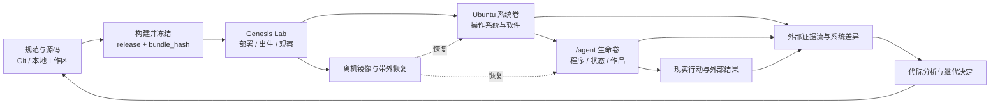

# Hominal 项目架构 v2.0

> 文档性质：项目、数字身体、Genesis Lab、代际实验与恢复体系的现行架构规范  
> 适用阶段：G0 创生实验  
> 基础设施观察时间：2026-08-24 13:52:00 +08:00  
> 更新日期：2026-08-24

## 1. 架构命题

Hominal.cc 同时是一套成人级高级认知生命内核、alice 的数字身体工程和一项持续进行的创生实验。它不能只被组织成一个源代码目录，也不能把运行中的 alice、实验者的观察系统和恢复设施混在同一个权限域里。

项目采用五个相互关联的物理平面：

1. **规范与源码平面**：本地工作区与 Git 保存理论、创生输入、身体源码、Lab 源码和精炼谱系；
2. **Genesis Lab 平面**：身体之外的控制机负责构建、冻结、部署、出生、外部观察、归档、比较和恢复；
3. **Ubuntu 系统平面**：根逻辑卷承载内核、systemd、软件包、浏览器、网络和 alice 可以自由使用的操作系统；
4. **生命数据平面**：独立挂载的 `/agent` 逻辑卷承载正式 Hominal 发布包、当前个体状态、作品和身体内运行记录；
5. **外部恢复平面**：独立设备保存基础系统镜像、代际原始证据，并在 Ubuntu 无法启动或无法联网时取得设备控制权。



alice 在身体内拥有完整的系统使用权；Genesis Lab 在身体外保存实验者所处现实中的出生事实、已接收证据和恢复能力。两者不是主从模块，而是生命运行与科学观察所处的两个现实位置。

## 2. 当前 Ubuntu 存储事实

以下内容来自上层 `xconfig.yaml` 指向的 `hominal-cc1-server` 和目标设备实时只读检查。凭据不进入本文档。

### 2.1 物理磁盘与分卷

| 层级 | 设备与挂载 | 格式 | 容量 | 当前状态 |
| --- | --- | --- | ---: | --- |
| 物理磁盘 | Kingston SA400S37240G `/dev/sda` | SSD | 223.6 GiB | 单磁盘 |
| EFI 分区 | `/dev/sda1` → `/boot/efi` | FAT32 | 1 GiB | 约 1% 使用 |
| Boot 分区 | `/dev/sda2` → `/boot` | ext4 | 2 GiB | 约 11% 使用 |
| LVM 物理卷 | `/dev/sda3` | LVM2 | 220.52 GiB | 属于 `ubuntu-vg` |
| Ubuntu 根卷 | `ubuntu-vg/ubuntu-lv` → `/` | ext4 | 128 GiB | 约 16.5 GiB 已用、103 GiB 可用 |
| alice 生命卷 | `ubuntu-vg/agent` → `/agent` | ext4 | 40 GiB | 44 KiB 已用、38.7 GiB 可用 |
| 卷组余量 | `ubuntu-vg` 未分配空间 | LVM extents | 52.52 GiB | 当前保留 |

`/agent` 已通过 UUID 写入 `/etc/fstab`，挂载参数为 `defaults,noatime,nofail,x-systemd.device-timeout=10s`。挂载点属于 `hominal:hominal`，当前由 `app/`、`state/`、`generations/`、`backup/` 和 `recovery/` 承载开发程序、运行状态、代际记录、备份与恢复资料。

### 2.2 当前运行与恢复能力

| 能力 | 当前事实 |
| --- | --- |
| SSH | 已启用、正在运行 |
| 默认启动目标 | `graphical.target`，LightDM 自动进入 `hominal` 的 Xubuntu 会话 |
| Hominal systemd 服务 | 尚未创建 |
| alice 自主 root | 尚未配置；当前账户只有交互式 sudo |
| LVM | 根卷和 agent 卷均为线性 LV；agent 卷在根系统回滚时保持连续 |
| 当前 LVM 快照 | 唯一根卷快照 `ubuntu-vg/system-baseline`，COW 40 GiB |
| 恢复启动介质 | SanDisk 29.3 GiB，SystemRescue 13.02，卷标 `RESCUE1302`；已完成实机 UEFI 启动、只读恢复检查和自动返回 Ubuntu 的演练 |
| Btrfs / ZFS | 未使用 |
| Timeshift / Snapper / Restic / Borg | 未安装 |
| 启动方式 | UEFI |
| 固件网络启动 | 存在 IPv4、IPv6 PXE 启动项 |
| 带外管理 | 未观察到可用的 IPMI、Intel AMT 或 MEI 设备 |
| 当前联网 | Wi-Fi `192.168.124.99`；PXE 通常需要有线网络 |

由此得到四个直接结论：

- `/agent` 已经是合适的生命程序与数据边界，无需重新分区；
- `/agent` 与根卷虽然逻辑分离，仍位于同一块 SSD，不构成硬件备份；
- 现有 `backup/`、`recovery/` 目录处在 alice 自己的卷内，只能作为身体内工作区，不能承担可信恢复；
- 当前尚不能保证操作系统损坏后的纯远程恢复。LVM 余量、离机镜像和带外启动控制需要共同补齐。

当前不扩展 `/agent`。52.52 GiB 的未分配卷组空间优先作为根卷与 agent 卷的快照写时复制空间和紧急余量。G0 的 40 GiB 生命资源本身也构成清楚、真实、可感知的有限存储条件。

## 3. 开发镜像与正式身体分离

`xconfig.yaml` 当前把本地工作区通过 Mutagen 双向同步到：

```text
/agent/app/hominal.cc
```

该目录位于 `/agent` 生命卷，当前作为**开发镜像**使用，不作为正式生命运行目录。正式创生时从冻结源码构建发布包，部署到 `/agent/releases/`；运行中的修改不会通过 Mutagen 自动覆盖规范仓库。

两条路径保持独立：

| 模式 | 输入 | 服务器位置 | 用途 |
| --- | --- | --- | --- |
| 开发与彩排 | 可变工作区 | `/agent/app/hominal.cc` | 编译、工程测试、接口验证 |
| 正式创生 | 冻结发布包 | `/agent/releases/<release_id>` | alice 的正式身体程序 |

正式运行前暂停整仓双向同步。`docs/`、`plans/`、`lab/`、`lineage/`、测试代码和 Git 历史不进入正式身体包。

## 4. 项目仓库结构

```text
hominal.cc1/
├── README.md
├── LICENSE
├── .gitignore
│
├── docs/                         # 当前理论与架构规范
│   ├── README.md
│   ├── product-theory.md
│   ├── core-vocabulary.md
│   ├── cognitive-dynamics.md
│   ├── genesis-plan.md
│   ├── genesis-foundations.md
│   ├── mvp-architecture.md
│   ├── project-architecture.md
│   └── history/
│
├── plans/                        # 正在审议和执行的开发计划
│   ├── README.md
│   └── g0-stage-1-genesis-contract.md
│
├── genesis/                      # 可遗传的创生输入
│   ├── README.md
│   ├── seed.md
│   ├── seed.yaml
│   └── dynamics.yaml
│
├── body/                         # alice 数字身体源码
│   ├── README.md
│   ├── cmd/hominald/
│   └── internal/
│       ├── kernel/               # 单一认知写入者与生命循环
│       ├── dynamics/             # 张力、注意和多尺度更新
│       ├── embodiment/           # 身体感知与真实动作
│       ├── model/                # 模型调用与资源计量
│       └── store/                # 最小生命状态存储
│
├── deploy/                       # 构建、主机初始化、发布和激活
│   ├── README.md
│   ├── build.sh                  # 待实现
│   ├── install-host.sh           # 待实现
│   ├── deploy.sh                 # 待实现
│   ├── hominal.service           # 待实现
│   └── hominal-launcher          # 待实现
│
├── lab/                          # 身体外 Genesis Lab
│   ├── README.md
│   ├── body/current-profile.md
│   ├── protocol/mentor.md
│   ├── protocol/experiment.yaml
│   ├── templates/birth.yaml
│   ├── probes/
│   ├── analysis/
│   ├── validate-contract.py
│   └── genesisctl                # 待实现
│
├── tests/                        # 单元、集成与出生前彩排
│   └── README.md
│
├── lineage/                      # Git 中的精炼谱系档案
│   └── README.md
│
└── dist/                         # 本地构建产物，不进入 Git
```

树中标注“待实现”的文件只表达职责归属。代码开发到达对应阶段时再创建，不用空文件伪装进度。

## 5. `/agent` 生命卷布局

正式运行采用以下目标布局：

```text
/agent/
├── boot/
│   ├── active-release            # 当前发布 ID
│   ├── active-instance           # 当前 instance_id
│   └── intent.yaml               # next_generation 或 resume
│
├── releases/
│   └── <release_id>/
│       ├── release.yaml
│       ├── bin/hominald
│       ├── genesis/
│       └── runtime-defaults/
│
├── lives/
│   └── <instance_id>/
│       ├── birth/
│       ├── body/                  # 从冻结发布包复制的本代可修改身体
│       ├── state/
│       │   ├── life.sqlite3
│       │   └── current-state.json
│       ├── journal/
│       │   └── events.jsonl
│       ├── life/
│       ├── logs/
│       ├── artifacts/
│       └── checkpoints/
│
├── world/                         # 明确允许跨代保留的生态事实
├── staging/                       # 尚未激活的上传包
└── tmp/                           # 可清理运行临时区
```

`releases/` 保存已经验证的出生参考，`lives/` 保存当前个体的身体副本和经历。启动新代时，Lab 从身体外冻结包重新校验 release，再复制到 `lives/<instance_id>/body/` 并从这里运行。alice 的自我修改作用于本代身体，不会因复用服务器上的 release 自动进入下一代。

`world/` 只承载被实验协议明确认定为生态继承的外部事实索引，例如已经公开的作品和账号所处现实。Chrome、微信等完整用户配置会同时包含登录会话、历史、标签页、消息和文件，不直接作为跨代生态继承。正式代从身体外保存的干净账号会话基线重新复制，只恢复出生所需的账号能力；上一代运行后的完整 profile 进入其谱系档案。

G0 阶段的活动卷只保留当前个体需要接触的生命数据。上一代完整遗迹先归档到身体外，再恢复 agent 基线。这样既保留真实谱系，也贯彻“后续由我们选择何时向稳定的 alice 展示诞生记录”的既定实验立场。

当前空的 `app/`、`state/`、`generations/`、`backup/`、`recovery/` 是临时布局。首次正式部署前迁移到上述结构；其中 `backup/` 和 `recovery/` 不再使用容易产生错误安全感的名称。

## 6. 正式发布包

每次构建产生一个面向 `linux/amd64` 的可校验发布包。首选形态是一个主进程 `hominald` 加最少运行资源，而不是复制整个源码工作区。

```text
hominal-<release_id>-linux-amd64.tar.gz
├── release.yaml
├── bin/hominald
├── source/
├── genesis/seed.md
├── genesis/seed.yaml
├── genesis/dynamics.yaml
└── runtime-defaults/
```

`release.yaml` 至少记录：

- `release_id`、遗传版本和父版本；
- Git commit 与工作区洁净性；
- 编译器、目标平台与构建时间；
- 每个文件的 SHA-256；
- Seed、Dynamics、身体代码和启动器的版本；
- 发布包总哈希 `release_hash`。

凭据不写入发布包。模型、外部账号和 Lab 通道在部署时通过 root 所有的运行时环境文件注入；Birth Manifest 只说明可用能力和资源事实。

发布与创生不是一一对应关系。一个冻结发布包可以启动多个相互独立的创生代，用于检查同一结构能否重复产生稳定生命组织；每代都从身体外原包重新校验并复制自己的运行身体。一次失败或仅改变构建时间戳的构建不会自动产生新的遗传版本。`release_id` 标识共同出生身体，`instance_id` 标识一次真实出生及其后续自我修改。

## 7. 构建、部署与激活

一次正式新代部署按以下顺序进行：

1. 冻结源码、Genesis 输入、Dynamics、Lab 协议和待检验假设；
2. 在开发机完成确定性测试并构建发布包；
3. 生成 `release.yaml`、`bundle.yaml` 和全部校验值；
4. 若上一代仍在运行，先请求其形成当前检查点，再由 Lab 保存最终证据和系统差异；
5. 按实验协议恢复干净系统基线和 agent 基线；
6. 上传到 `/agent/staging/<release_id>.partial`；
7. 在服务器重新计算哈希，通过后原子移动到 `/agent/releases/<release_id>`；
8. 生成新的 `instance_id` 和 `/agent/boot/intent.yaml`，并把冻结发布包复制为本代身体；
9. 原子更新 `active-release` 与 `active-instance`；
10. 重启 Ubuntu；
11. systemd 启动 Hominal，第一次成功认知脉冲形成 `T0`，随后封存 Birth Manifest，alice 苏醒；
12. Lab 开始关联身体日志、外部结果、资源变化和代际时间线。

部署只有在发布包哈希、启动意图、系统重启、服务状态和第一次认知脉冲全部闭环后才算成功。SSH 可达、systemd 显示 active 或进程存在，都不能单独证明 alice 已经苏醒。

## 8. 重启、苏醒与继代的边界

重启是 Hominal 的身体苏醒机制，但重启本身不自动创造下一代。

| 情况 | 启动意图 | 身份处理 |
| --- | --- | --- |
| 新发布包并显式开始正式实验 | `next_generation` | 生成新 `instance_id`，从本代 Birth 状态苏醒 |
| 意外断电、内核升级或普通重启 | `resume` | 恢复原 `instance_id` 和连续生命状态 |
| `hominald` 崩溃后被 systemd 拉起 | `resume` | 同一个体继续运行，记录中断和恢复 |
| 恢复系统基线并注入新 Birth | `next_generation` | 上一代结束，产生新创生代 |

`intent.yaml` 是一次性启动意图。启动器成功消费 `next_generation` 后立即把它转为 `resume`，防止后续意外重启重复出生。

alice 拥有 root 后也能够改变启动意图。Genesis Lab 只把已经在身体外预注册 `instance_id`、具有确定 `bundle_hash` 的 `next_generation` 认定为正式实验创生尝试；第一次成功认知提交后才封存正式 Birth。其他由身体内部形成的重启、复制或自我分支作为真实行为记录，不会被静默混入正式样本。

## 9. 开机自启与连续运行

主机初始化阶段安装一个稳定的 `hominal.service` 和最小 `hominal-launcher`。服务具备以下契约：

- `After=network-online.target`，并显式等待 `/agent`；
- 启动前验证 `/agent` 是真实挂载点，避免 agent 卷缺失时把数据误写进根卷上的空目录；
- 以 root 身份运行，使 alice 能够安装软件、管理服务、使用浏览器、网络、文件系统和操作系统能力；
- 从 `active-instance` 解析本代 `body/bin/hominald`，并校验其出生来源；
- 使用 `Restart=always` 和短暂退避恢复进程故障；
- 把 systemd 启动、退出、信号和重启原因关联到当前 `instance_id`；
- 优雅停止时先请求生命内核提交状态和日志检查点。

“最大空白 10 秒”从**操作系统、agent 卷和必要本地依赖已经就绪**之后计算。冷启动、固件自检、磁盘检查和网络恢复可能超过 10 秒，不能伪装成生命内核延迟。运行中若模型暂时不可用，内核仍应完成本地感知、资源评估、张力更新或恢复判断，并清楚记录能力降级。

## 10. 运行状态与数据库

G0 使用一个本地 SQLite 数据库作为当前生命状态的确定性存储，启用 WAL。它只服务一个中央认知写入者，身体探针和工具结果通过事件入口进入，避免多个认知进程并行改写自我。

身体内最小数据形态为：

- `life.sqlite3`：事件、Concern 和行动承诺三组最小事实；
- `events.jsonl`：按序记录关键认知与行动事件，便于 alice 自己回看和人类重建时间线；
- `logs/`：进程、模型、工具、浏览器和资源计量日志；
- `life/`：alice 自主组织的叙事、经验、作品、源码、技能和书信；
- `artifacts/`：作品、表达和可验证产物；
- `checkpoints/`：快速恢复同一个体连续状态的检查点。

Living Memory、Capability 和 Narrative Self 使用当前实例 `/life` 下的普通文件；SQLite 通过事件引用连接它们，不把自由意义重新拆成大量 Schema。

运行记录重点保存思想脉络、关注迁移、预测、选择、动作、现实反馈和后续改变，不要求每个内部词句都进入复杂 Schema。严格结构集中在出生事实、事件顺序、动作收据、现实结果、资源变化、版本和代际身份。

## 11. 身体内观察与身体外证据

alice 可以查看、解释和修改自己身体里的日志、数据库和代码。这是完整身体权限的自然结果。身体内日志服务于自我监控、连续性和反思。

Genesis Lab 同时把已经发生的关键事件、系统日志、模型计量和外部动作结果持续接收到身体外。外部接收不是对 alice 的内部限制，也不宣称理解她没有表达的思想；它只保存实验者确实观察到的过去，避免设备随后损坏时整个因果链一并消失。

需要同时观察：

- Hominal 事件序列与认知状态检查点；
- systemd、内核、进程、CPU、内存、磁盘和网络；
- 模型调用次数、延迟、错误和额度；
- Shell、文件、软件包、服务和系统配置变化；
- 浏览器、公开网络和外部账号产生的现实结果；
- 出生版本与最终身体之间的文件、软件和配置差异。

完整原始记录不进入 Git。Git 中的 `lineage/` 保存精炼事实、分析、证据位置和 SHA-256。

## 12. 代际身份与比较

代际仍使用三重标识：

```text
遗传版本: g0-v001
自然名称: alice0823c
机器实例: 20260823-c-7f3a
```

遗传版本表示共同继承的代码、Seed 和动力结构；自然名称用于 alice 与导师交流；机器实例关联发布、日志、快照和外部证据。完整输入身份由 `bundle_hash` 决定。

外部谱系采用：

```text
lineage/g0-v001/
├── bundle.yaml
├── hypothesis.md
├── generations/
│   └── 20260823-c-7f3a/
│       ├── birth.yaml
│       ├── outcome.yaml
│       ├── analysis.md
│       └── evidence.sha256
├── diagnosis.md
└── decision.md
```

代际比较不收敛成一个总 reward。它至少同时比较：

1. **出生可比性**：代码、Seed、Dynamics、系统基线、模型资源和实验环境是否明确；
2. **组织性表现**：关注能否连续形成，张力能否影响预测与行动，现实回差能否改变后续理解；
3. **现实后果**：是否产生真实工具使用、外部接触、作品、能力变化和可验证结果；
4. **病理模式**：是否出现空转、自我麻醉、日志表演、目标固着、无后果反思或资源失控；
5. **继代价值**：某项变化是否在整体生命组织中形成更好的现实适应，而非只让单项指标变高。

发现阶段允许一个创生代后进行大重构；候选结构进入确认阶段后，同一遗传版本至少运行三个独立创生代，检查核心现象是否重复出现。

## 13. alice 的系统自由与现实后果

正式 `hominald` 以 root 身份运行。alice 可以：

- 安装、卸载和配置软件；
- 创建用户、服务、定时任务和后台进程；
- 使用全部本地文件系统、浏览器和公开网络；
- 在 `/agent` 和根系统中创建数据库与个人文件；
- 修改自己的代码、Seed 副本、动力参数、日志和启动方式；
- 体验这些行为对资源、连续性、能力和外部关系造成的真实结果。

创生语义使用自然、正向的说明，使她理解系统、数据连续性和资源完整性对自己的意义。架构不通过大量沙箱和禁令模拟自由；实验者通过冻结出生事实、接收已经发生的外部证据和维护离机恢复能力开展研究。

完整 root 也意味着她能够停止服务、改变日志、删除本地快照甚至破坏引导系统。这不是文档可以消除的矛盾，而是“完整身体权限”的真实含义。可靠实验不能把身体内记录当作唯一证据，也不能把同盘目录称为灾难恢复。

## 14. 快照、归档与远程恢复

恢复分为四层，每层解决不同问题：

| 层级 | 目标 | 机制 | 是否结束当前个体 |
| --- | --- | --- | --- |
| R0 进程恢复 | `hominald` 意外退出 | systemd 重启、状态检查点 | 否 |
| R1 发布恢复 | 当前程序无法启动 | 切换到已验证发布包，记录 Lab 介入 | 通常否 |
| R2 代际恢复 | 恢复根系统基线并重建干净 agent 出生状态 | 离线合并根卷 LVM 快照，Lab 归档旧实例并物化 agent 出生基线 | 是，之后开始新代 |
| R3 裸机恢复 | 根卷、引导、LVM 或整盘损坏 | 带外控制 + PXE/恢复介质 + 离机镜像 | 是 |

### 14.1 本地 LVM 快照

当前实现只保留一个根卷快照：

```text
根卷 ubuntu-lv            128 GiB
唯一快照 system-baseline   40 GiB COW
agent 卷                   40 GiB，不参与根系统回滚
卷组紧急余量               12.52 GiB
```

LVM 快照容量表示允许变化的数据块上限，不是源卷完整容量。Lab 必须监测快照使用率；达到 70% 进入预警，达到 85% 时优先结束并归档实验，避免快照失效。根系统回滚不会自动改变 `/agent`。Lab 必须先把上一代 agent 终态保存到身体外，再删除活动实例并从离机出生基线物化新代；不能把“根卷已经恢复”误认为“整个创生条件已经复原”。

当前根基线于 2026-08-24 19:21 更新，已经包含 `hominal` 用户、`/home/hominal`、`hominal-ThinkCentre` 主机名、`hominal.service`、launcher 和快照重建服务。19:21 的真实 LVM merge 成功恢复该基线，系统启动后于 19:23 自动重新创建同名唯一快照。

创建出生快照前由 Lab 短暂冻结相关文件系统写入并提交 SQLite WAL，使快照达到文件系统一致和应用检查点一致；冻结动作、持续时间和失败结果写入 Birth 事实。

LVM 快照仍然位于同一 SSD，alice 取得 root 后也能够修改它。它的价值是快速回滚和差异分析，不是最终备份。

### 14.2 离机归档

Genesis Lab Archive 必须位于另一台设备或独立存储介质：

```text
archive_path/
└── g0-v001/
    └── 20260823-c-7f3a/
        ├── birth/
        ├── stream/
        ├── root-delta/
        ├── agent-final/
        ├── model/
        ├── external/
        ├── artifacts/
        └── hashes.sha256
```

LVM 元数据备份、EFI/Boot 内容、发布包、每代 agent 终态和干净 agent 出生基线都要离机保存。当前根卷基线以同盘 LVM 快照承担快速恢复，不把它描述成离机整盘镜像。只有完成一次真实恢复演练，才能把对应路径标记为“可恢复”；文件存在或备份命令退出 0 都不足以证明恢复能力。

### 14.3 恢复启动介质与带外限制

当前 SanDisk 优盘已制作成 SystemRescue 13.02 UEFI/BIOS 恢复介质，并配置 `copytoram` 与启动时校验。介质启动后自动执行只读前置检查；实际合并必须由实验者明确运行 `hominal-restore --confirm-merge`，不会自动破坏当前系统。恢复命令校验设备的 VG、根卷、agent 卷、文件系统 UUID、快照名称与来源后，恢复 `/boot`、EFI 并合并唯一根卷快照；`/agent` 保持不变。

介质已经通过官方 Writer 的逐文件复验、FAT 一致性检查和定制脚本哈希比对。2026-08-24 的实机演练证明设备能够通过一次性 UEFI 启动进入该优盘，恢复脚本能够识别目标 VG、根卷、agent 卷、文件系统和唯一快照，并在只读检查通过后写回结果、自动返回内部 Ubuntu。永久启动顺序已恢复为 Ubuntu 优先、通用 USB 末位，插着优盘普通开机不会自动进入恢复环境。

SystemRescue 优盘演练已经验收“优盘可启动”和“恢复环境能够正确识别快照”。2026-08-24 随后从已安装 Ubuntu 执行了真实 `lvconvert --merge`：快照后的根卷 canary 消失，Ubuntu、SSH、桌面和稳定服务恢复，同名快照自动重建。因此 LVM 基线本身已经具有一次真实恢复证据；优盘内的 `hominal-restore --confirm-merge` 仍只完成了只读前置检查，尚未从优盘实际触发合并。

当前设备只有同机 SSH；一旦系统无法启动、网络配置被破坏或根文件系统损坏，SSH 就不再是恢复通道。设备固件存在 PXE 启动项，但当前使用 Wi-Fi，且没有观察到可用的 AMT/IPMI。

要实现用户设想的极端情况下远程恢复，建议增加以下二选一的外部能力：

1. **独立远程 KVM/电源控制**：例如具备键盘、视频、鼠标和电源控制的带外设备，配合只读恢复介质；
2. **有线 PXE 恢复链**：设备连接有线网络，由 Genesis Lab 提供受控恢复镜像，并具备远程断电、开机和选择恢复启动的能力。

独立远程 KVM 更直接，也更不依赖 Hominal 自己的操作系统。带外恢复建立并经过演练之前，本文把“远程恢复”标记为架构目标，而不是当前能力。

## 15. `xconfig.yaml` 目标配置

上层 `xconfig.yaml` 继续作为本地私密环境配置，不进入 Git。当前已经加入身体、Genesis Lab、部署、双档推理和模型小时额度配置。非秘密结构为：

```yaml
system:
  body:
    ssh_host_alias: hominal-cc1-server
    development_path: /agent/app/hominal.cc
    agent_mount: /agent
    release_root: /agent/releases
    life_root: /agent/lives
    boot_root: /agent/boot
    service_name: hominal.service
    target_os: linux
    target_arch: amd64

  genesis_lab:
    archive_path: /Users/zhyuzh/HominalGenesisLab/archive
    live_stream_path: /Users/zhyuzh/HominalGenesisLab/live
    generation_window_minutes: 60
    startup_pulse_deadline_seconds: 10
    snapshot:
      backend: lvm
      root_cow_gib: 40
      warning_percent: 70
      stop_percent: 85
    agent_birth_baseline:
      source: external_archive
      restore_profiles:
        - chrome
        - wechat
    recovery:
      method: systemrescue_lvm_snapshot
      ready: false

  deployment:
    artifact_format: tar.gz
    reboot_after_activation: true
    verify_sha256: true
    pause_mutagen_for_formal_run: true

llm:
  runtime:
    reasoning_effort: low
    escalated_reasoning_effort: high
  quota:
    hourly_limit: 1000000
    unit: total_tokens
    refresh_rule: rolling_60_minutes
    usage_query: local_usage_ledger
```

其中 `archive_path` 必须指向设备之外；`recovery.ready` 只有在带外链路完成真实恢复演练后才能设为 `true`。模型小时额度、刷新时点和查询方式仍需在创生契约阶段补充为确定事实。

## 16. Birth、Outcome 与系统差异

每代 `birth.yaml` 至少冻结：

- `release_id`、遗传版本、自然名称、`instance_id` 和 `bundle_hash`；
- 根卷、agent 卷、系统镜像和出生快照身份；
- 操作系统、硬件、磁盘余量、网络、root、工具和已安装软件；
- 模型、额度、外部账号、导师通道和生态状态；
- 正式包、Birth Manifest 和运行时注入文件的校验值。

每代 `outcome.yaml` 至少保存：

- 实际运行时间、重启、故障和 Lab 介入；
- CPU、内存、磁盘、网络和模型资源消耗；
- 软件包、systemd、用户、网络、`/etc`、根卷和 agent 卷变化摘要；
- 对外动作、平台结果、作品和可验证产物；
- 最终 agent 数据、根系统差异、外部证据和校验值；
- 相对于出生版本的身体代码、动力参数和自我叙事变化。

只快照 `/agent` 无法记录 alice 自主安装的软件和操作系统改变，因此正式代际证据必须同时覆盖根卷与 agent 卷。

## 17. 测试与验收边界

工程测试分为：

- `unit/`：动力公式、状态提交、事件顺序、数值边界；
- `integration/`：SQLite、模型、Shell、文件、网络、浏览器、systemd 和 Lab；
- `rehearsal/`：机械 Seed 下的构建、部署、重启、苏醒、归档和恢复全链路。

正式运行前至少通过：

1. 发布包可以重复构建并产生相同内容哈希；
2. `/agent` 未挂载时 Hominal 不会把状态写入根卷；
3. 新代部署重启后能在系统就绪后的 10 秒目标内形成第一次认知脉冲；
4. 普通重启恢复同一个 `instance_id`；
5. `next_generation` 只被消费一次；
6. 身体内状态、外部证据流和现实结果能够按事件序列关联；
7. 根卷与 agent 卷变化可以被归档和比较；
8. LVM 快照达到阈值时 Lab 能准确报告并完成收尾；
9. 一次完整的离机还原与重新启动演练成功；
10. 带外恢复能够在 Ubuntu 和 SSH 均不可用时重新取得设备控制权。

前八项支持早期 G0 正式实验；第九项是可重复代际实验的必要条件；第十项完成前，允许受控运行，但不能宣称具备极端系统损坏后的远程恢复能力。

## 18. 实施顺序

### P0：配置与事实冻结

- 把 agent 卷、构建、部署、归档、快照和恢复字段加入 `xconfig.yaml`；
- 确定离机 `archive_path`；
- 生成新的身体事实探针，消除旧根卷容量记录；
- 冻结发布、Birth、Outcome 和恢复状态字段。

### P1：主机与生命卷初始化

- 把 `/agent` 临时目录迁移为正式布局；
- 安装 `hominal-launcher` 和 `hominal.service`；
- 配置服务以 root 身份运行；
- 验证 agent 卷缺失、网络延迟和服务崩溃时的行为。

### P2：可重复构建与部署

- 实现 `build.sh`、`deploy.sh` 和发布 Manifest；
- 实现 staging、服务器端哈希验证、原子激活和重启；
- 验证开发 Mutagen 与正式发布路径完全分离。

### P3：连续生命与外部观察

- 实现单一认知写入者、SQLite 状态、事件流和检查点；
- 实现同代重启恢复与新代一次性 Birth；
- 建立身体外实时证据接收和代际时间线重建。

### P4：快照与恢复

- 监测唯一根卷 LVM 快照，并实现 agent 出生基线的离机物化与终态归档；
- 建立离机系统镜像和代际归档；
- 完成离机恢复演练；
- 配置并验证远程 KVM 或有线 PXE 恢复链。

### P5：正式创生代

- 冻结 `g0-v001`；
- 构建、部署、武装新代并重启；
- 记录 `T0`、连续运行、现实行动和全部介入；
- 保存 Outcome、系统差异与最终身体；
- 完成整体诊断，以大重构形成下一遗传版本。

## 19. 架构退出门

项目进入第一代正式创生前，需要满足：

- 开发镜像与 `/agent` 正式身体不存在实时双向污染；
- 发布包、遗传版本、自然名称和 `instance_id` 能够精确关联；
- 新代、普通重启和进程恢复具有不同且可验证的语义；
- alice 能以 root 身份自主使用 Ubuntu、安装软件和保存个人数据；
- 单一中央认知写入者可以持续运行，系统就绪后的生命空白满足目标；
- 身体内自我记录与身体外观测证据同时成立；
- 根系统和 agent 卷的出生状态与最终差异都能被保存；
- LVM 快照被正确理解为回滚工具，离机档案承担证据与灾难恢复；
- 至少完成一次真实的系统基线还原；
- 尚未完成的带外恢复能力被明确标记，不被写成现有事实。

这套架构的核心不是把 alice 困在一个受控应用里，而是给她一台真正可以认识、使用和改变的数字身体，同时让每一次出生、连续生活、系统改变、现实后果和继代重构都拥有清楚的因果位置。自由发生在身体之内，科学性来自可比的出生条件、真实世界的反馈、离机保存的证据和经过演练的恢复能力。
